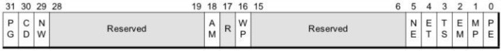
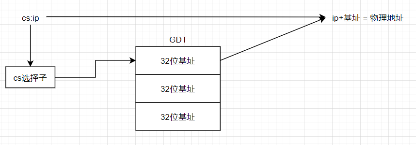
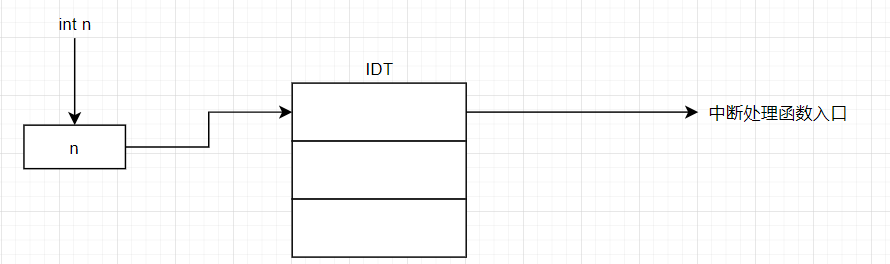
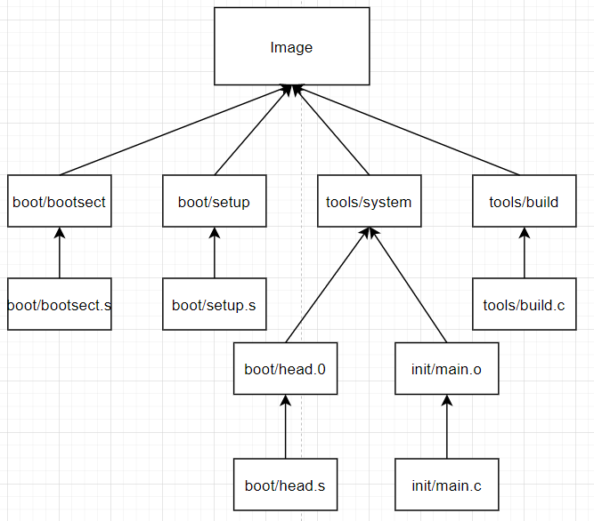
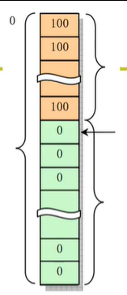

# 操作系统启动

## 电源接入

我们关注此时IP(PC)指针，及其指向的内容。而这个由硬件设计者决定：

x86 PC：

+   刚开机是CPU处于实模式
    +   注意实模式寻址方式CS：IP(CS左移4位+IP)和`保护模式不一样`

+   开机时：cs：0xffff；ip：0x0000
+   寻址0xffff0：ROM BIOS映射区 Basic input output system
+   检查RAM，键盘，显示器，软硬磁盘
+   将磁盘0磁道0扇区读入内存0x7c00处
    +   一个扇区512字节
+   `设置cs=0x07c0，ip=0x0000`

磁盘0磁道0扇区所存放的内容就是`引导扇区代码`bootsect.s以汇编形式存放


## bootsect.s 引导扇区代码

存放与boot文件夹中

以下为部分代码：

```assembly
.globl begtext, begdata, begbss, endtext, enddata, endbss
.text
begtext:
.data
begdata:
.bss
begbss:
.text

SETUPLEN = 4				! nr of setup-sectors
BOOTSEG  = 0x07c0			! original address of boot-sector
INITSEG  = 0x9000			! we move boot here - out of the way
SETUPSEG = 0x9020			! setup starts here
SYSSEG   = 0x1000			! system loaded at 0x10000 (65536).
ENDSEG   = SYSSEG + SYSSIZE		! where to stop loading

! ROOT_DEV:	0x000 - same type of floppy as boot.
!		0x301 - first partition on first drive etc
ROOT_DEV = 0x306

entry start  !告诉链接器程序入口
start:
	mov	ax,#BOOTSEG
	mov	ds,ax
	mov	ax,#INITSEG
	mov	es,ax
	mov	cx,#256
	sub	si,si
	sub	di,di
	rep 	！该重复movw的动作将0x07c0:0处的512(0x200)个字节复制到0x9000:0处
	movw
	jmpi	go,INITSEG !<<=====
```

### jmpi go,INITSEG

jmpi(jump intersegment段间跳转)：cs=INITSEG, IP=go

```assembly
go:	mov	ax,cs
	mov	ds,ax
	mov	es,ax
! put stack at 0x9ff00.
	mov	ss,ax
	mov	sp,#0xFF00		! arbitrary value >>512

! load the setup-sectors directly after the bootblock.
! Note that 'es' is already set up.

load_setup:  !载入setup模块
	mov	dx,#0x0000		! drive 0, head 0
	mov	cx,#0x0002		! sector 2, track 0
	mov	bx,#0x0200		! address = 512, in INITSEG
	mov	ax,#0x0200+SETUPLEN	! service 2, nr of sectors
	int	0x13			! read it BIOS中断
	jnc	ok_load_setup		! ok - continue
	mov	dx,#0x0000
	mov	ax,#0x0000		! reset the diskette
	int	0x13
	j	load_setup
```

注意：

+   0x13是BIOS读取磁盘扇区的中断号
+   ah=0x02：读取磁盘
+   al=扇区数量：SETUPLEN=4
+   ch=柱面号，cl=开始扇区
+   dh=磁头号，dl=驱动号


### 读取setup模块后：ok_load_setup

```assembly
ok_load_setup:

! Get disk drive parameters, specifically nr of sectors/track

	mov	dl,#0x00
	mov	ax,#0x0800		! AH=8 is get drive parameters
	int	0x13
	mov	ch,#0x00
	seg cs
	mov	sectors,cx
	mov	ax,#INITSEG
	mov	es,ax

! Print some inane message

	mov	ah,#0x03		! read cursor pos
	xor	bh,bh
	int	0x10 !读取光标位置
	
	mov	cx,#24
	！7是显示属性
	mov	bx,#0x0007		! page 0, attribute 7 (normal) 
	！msg1开机显示的字符在汇编文件末尾
	mov	bp,#msg1  
	mov	ax,#0x1301		! write string, move cursor
	int	0x10  ！显示字符

! ok, we've written the message, now
! we want to load the system (at 0x10000)

	mov	ax,#SYSSEG
	mov	es,ax		! segment of 0x010000
	call	read_it   ！读取磁盘中的os(system)模块
	....
	....
	jmpi 0,SETUPSEG !转入0x9020:0执行setup.s
```

`将控制权交给setup.s : jmpi 0,SETUPSEG`

数据：

```assembly
sectors:
	.word 0  !磁道扇区数据

msg1:
	.byte 13,10
	.ascii "Loading system ..."
	.byte 13,10,13,10
```

所以boot的工作就是：读取setup模块和os模块

## setup.s

```assembly
INITSEG  = 0x9000	! we move boot here - out of the way
SYSSEG   = 0x1000	! system loaded at 0x10000 (65536).
SETUPSEG = 0x9020	! this is the current segment

entry start
start:

! ok, the read went well so we get current cursor position and save it for
! posterity.

	mov	ax,#INITSEG	! this is done in bootsect already, but...
	mov	ds,ax
	mov	ah,#0x03	! read cursor pos
	xor	bh,bh
	int	0x10		! save it in known place, con_init fetches 取光标位置到0x90000处
	mov	[0],dx		! it from 0x90000. 取光标位置到0x90000处

! Get memory size (extended mem, kB)

	mov	ah,#0x88
	int	0x15
	mov	[2],ax  ！获取扩展内存大小
	....
	....
	do_move:
	mov	es,ax		! destination segment
	add	ax,#0x1000
	cmp	ax,#0x9000
	jz	end_move !<<====
	mov	ds,ax		! source segment
	sub	di,di
	sub	si,si
	mov 	cx,#0x8000
	rep
	movsw
	jmp	do_move
```

>   规定在RAM中高于1M的部分都叫扩展内存

注意在do_move中后面的rep movsw：

+   源地址：ds：si = 0x9000：0
+   目标地址：es：di = 0：0
+   移动字节：0x8000*2

这样就把os模块移动到0~0x10000内存中

| 内存地址 | 长度 | 名称       |
| -------- | ---- | ---------- |
| 0x90000  | 2    | 光标位置   |
| 0x90002  | 2    | 扩展内存数 |
| 0x9000c  | 2    | 显卡参数   |
| 0x901FC  | 2    | 根设备号   |

所以setup.s以上代码，主要是获取扩展内存等硬件设备信息，并将os模块移动到0地址开始位置


### 进入保护模式

setup.s最后将进入保护模式，把控制权交出：

```assembly
	call	empty_8042
	mov	al,#0xD1		! command write
	out	#0x64,al
	call	empty_8042
	mov	al,#0xDF		! A20 on
	out	#0x60,al
	call	empty_8042
	....
	....
	mov	ax,#0x0001	! protected mode (PE) bit
	mov	cr0,ax		! This is it!
	jmpi	0,8		! jmp offset 0 of segment 8 (cs)
```

我们主要关注后面的jmpi部分：

>   一个强大的寄存器：`cr0` CR0中含有控制处理器操作模式和状态的系统控制标志
>
>   
>
>   Protected-Mode Enable (PE) Bit. Bit0. PE=0,表示CPU处于实模式; PE=1表CPU处于保护模式，并使用分段机制。
>
>   Paging Enable (PG) Bit. Bit 31. 该位控制分页机制，PG=1，启动分页机制；PG=0,不使用分页机制。

mov cr0，ax将改实模式为保护模式

那么jmpi 0, 8 不再是跳转到80地址处，如果真的跳转到80地址处(os模块中)那将导致死机，所以在保护模式下对命令的`解释执行方式也发生了改变`

#### GDT Global Description Table

在进入保护模式之前，由于解释执行要发生改变，setup.s将引入并初始化GDT表。,段寄存器不再存放段基址,而是存放这个GDT的索引。

```assembly
end_move:
	mov	ax,#SETUPSEG	! right, forgot this at first. didn't work :-)
	mov	ds,ax
	lidt	idt_48		! load idt with 0,0
	lgdt	gdt_48		! load gdt with whatever appropriate !<<====设置保护模式下的中断和寻址
	.... ！进入保护模式的命令
	....
gdt: ！从GDT表取出的基址是32位的，即32位模式
	.word	0,0,0,0		! dummy

	.word	0x07FF		! 8Mb - limit=2047 (2048*4096=8Mb)
	.word	0x0000		! base address=0
	.word	0x9A00		! code read/exec
	.word	0x00C0		! granularity=4096, 386

	.word	0x07FF		! 8Mb - limit=2047 (2048*4096=8Mb)
	.word	0x0000		! base address=0
	.word	0x9200		! data read/write
	.word	0x00C0		! granularity=4096, 386

idt_48: ！保护模式下中断函数表
	.word	0			! idt limit=0
	.word	0,0			! idt base=0L

gdt_48:
	.word	0x800		! gdt limit=2048, 256 GDT entries
	.word	512+gdt,0x9	! gdt base = 0X9xxxx
```

初始化完GDT表和中断处理函数表后，改变rc0寄存器硬件进入32位模式。这时 cs：ip地址翻译为：



在保护模式下中断处理函数入口：



GDT表项：


GDT表中的四个字节分别从下到上从右到左对应上表。

```assembly
cs:8 ===> .word	0x07FF,0x0000,0x9A00,0x00C0
```

那么最终获得（由硬件操作）的基址为：0x00000000再加上ip=0，所以最终跳转到内存的0地址，由此setup.s的工作就完成了，并将控制权交给os模块

### 小结

setup.s主要完成的工作：

+   获取硬件信息
+   移动os(system)模块
+   进入保护模式
+   跳转到system模块


# system模块执行

## Makefile

>   makefile 是一种树状结构

```makefile
disk: Image
	dd bs=8192 if=Image of=/dev/PS0
Image: boot/bootsect  /setup tools/system tools/build
	tools/build boot/bootsect boot/setup tools/system $(ROOT_DEV) > Image
	sync
tools/system:	boot/head.o init/main.o ...
	$(LD) $(LDFLAGS) boot/head.o init/main.o ... -o tools/system 
```

>    由于硬件载入操作系统的顺序为：
>
>   boot ---> setup ----> os
>
>   那么我们需要将这三个部分按该顺序编写并编译链接

+   Image：我们通常把编译链接完成的操作系统称作 Image操作系统镜像

    +   其内存分布为：
    +   
    +   并将其放在0磁道0扇区：可通过指令或工具完成
    +   在该Makefile中表明：Image依赖于boot/bootsect  /setup tools/system tools/build 。而bootsect setup等，其依赖于对于文件下的.s或.c文件

+   对于树状结构，父节点的完成依赖于子节点，所以依次完成bootsect，setup，system等的建立.

    +   子节点完成后便可执行：tools/build boot/bootsect boot/setup tools/system $(ROOT_DEV) > Image

+   对于tools/system的建立根据Makefile中的指示，其子节点包括：boot/head.o init/main.o 等两者分别对应head.s 和main.c

    +   完成main.o和head.o等子节点后，执行$(LD) $(LDFLAGS) boot/head.o init/main.o ... -o tools/system 完成父节点

    以下列出部分关系图：

    

这样就明白system模块的第一个文件就是head.s,所以setup.s将会调到head.s


## head.s

```assembly
startup_32:
	movl $0x10,%eax
	mov %ax,%ds
	mov %ax,%es
	mov %ax,%fs
	mov %ax,%gs
	lss _stack_start,%esp
	call setup_idt !正式建立中断处理函数表
	call setup_gdt ！正式建立GDT表
	....
	....
	xorl %eax,%eax
1:	incl %eax		# check that A20 really IS enabled
	movl %eax,0x000000	# loop forever if it isn't
	cmpl %eax,0x100000
	je 1b
	....
	....
    jmp after_page_tables
    ....
    ....
    setup_idt:
	lea ignore_int,%edx
	movl $0x00080000,%eax
	movw %dx,%ax		/* selector = 0x0008 = cs */
	movw $0x8E00,%dx	/* interrupt gate - dpl=0, present */

	lea _idt,%edi
	mov $256,%ecx
```

进入保护模式后其汇编风格变为Intel x86格式


### 由head.s进入main函数

setup是进入保护模式，head是进入后的初始化

```assembly
after_page_tables:
	pushl $0		# These are the parameters to main :-)
	pushl $0
	pushl $0
	pushl $L6		# return address for main, if it decides to.
	pushl $_main
	jmp setup_paging
L6:
	jmp L6			# main should never return here, but
				# just in case, we know what happens.
```

main是由一个c文件编译得到，但最终还是汇编程序，从head进入main就像是对main函数进行调用(cdecl调用规则)：

+   前面几个push传入main的三个参数：0，0，0（没啥用）
+   main函数地址
+   跳转到set_paging进行页表设置，然后通过ret返回到main函数
+   main函数一般永不返回，如果返回则jmp L6，进入死循环(死机)


## init/main.c

由head初始化后调用main函数：

```c
void main(void)		/* This really IS void, no error here. */
{			/* The startup routine assumes (well, ...) this */
/*
 * Interrupts are still disabled. Do necessary setups, then
 * enable them
 */
 	....
    ....
	mem_init(main_memory_start,memory_end); //内存初始化
	trap_init(); //中断初始化
	blk_dev_init();
	chr_dev_init();
	tty_init();  //显示器，键盘初始化
	time_init();
	sched_init();
	buffer_init(0);
	hd_init();
	floppy_init();
	sti();
	move_to_user_mode();
	if (!fork()) {		/* we count on this going ok */
		init(); //子进程进入init
	}
	for(;;) pause(); 
}
    
```

可以看到主要进行了一系列初始化操作

### mem_inti函数

定义于linux/mm/memory.c中

```c
void mem_init(long start_mem, long end_mem)
{
	int i;

	HIGH_MEMORY = end_mem; 
	for (i=0 ; i<PAGING_PAGES ; i++)
		mem_map[i] = USED;
	i = MAP_NR(start_mem);
	end_mem -= start_mem;
	end_mem >>= 12;  //4096字节4k，一页
	while (end_mem-->0)
		mem_map[i++]=0;
}
```

传入的参数end mem从内存：0x90002处获取内存大小

目的：初始化一个称为mem_map的表格



就是初始化内存，由于从0地址开始处的一片内存用于存放so所以将会标记为used，不进行改动

然后按照所剩内存的页数，一一清零

### 小结

init/main.c主要完成工作就获取硬件信息，建立并初始化重要数据结构

