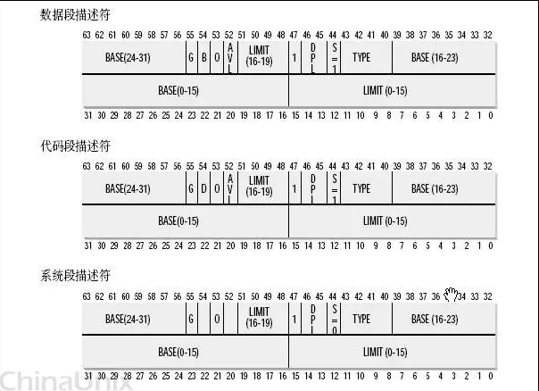
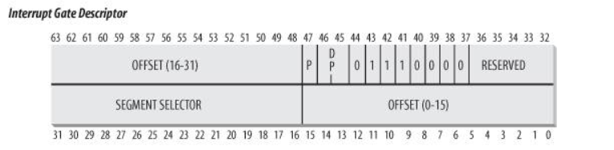
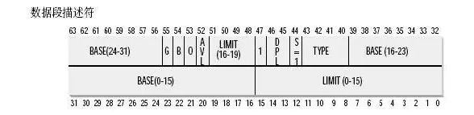

# 系统调用的实现

## 操作系统接口

一句话：就是操作系统提供的系统调用


## 用户态与内核态的隔离

通过一种处理器硬件设计，判断当前程序执行在什么态（0是内核态，3是用户态）。

+   CPL：全称current privilege level，存放在代码段寄存器中（cs），代表当前执行程序的特权级

+   RPL:  全称request privilege level，请求特权级，存放在段选择子中

+   DPL:  全称descriptor privilege level，存放在段描述符中，用于表示段的特权级
    +   在head.s中进行GDT表初始化时就将各种段设置好DPL特权级
    +   


在进行数据访问或者指令跳转时会进行检查：

+   DPL >= CPL
+   DPL >= RPL

`将os所在段的DPL特权级设置为0，用户段设置为3这样就可以将两者隔离开`


## int 0x80的细节

int 0x80由用户态调用，那么这条指令是如何进入内核态，得意访问内核的函数以及数据呢？这就需要回到os中进行初始化的一些函数。


### IDT Interrupt Descriptor Table



一个中断门由4个字节组成：

offset : 中断服务程序偏移（interrupt service routine ，ISR）

```C
/*
1. offset_low: 32位偏移的低16位
2. selector: 选择子
    1) 段索引
    2) 指示位
        2.1) 0表示在GDT中选择
        2.2) 1表示在LDT中选择
    3) 当前请求特权级(想要访问什么级别的段)
3. reserved: 保留字段
4. type: 段类型
5. always: 总为1
6. DPL: (描述符特权级 Descriptor Privilege Level)
表示允许访问此段的最低特权级("段选择子"中有一个字段(RPL)是标识这个段选择子也即这个内存访问请求的特权级)，这样是不是就把对应关系建立起来了，比如DPL为0的段只有当RPL=0时才能访问，而DPL为3的段，可由任何RPL的
代码访问。这样就解释了为什么ring3的内存空间ring0的内核代码可以任意访问，而ring0的内存空间ring3不能访问了
7. present
8. offset_high: 32位偏移的高16位
*/
typedef struct IDT_GATE_DESCRIPTOR
{
    P2C_U16 offset_low;        
    P2C_U16 selector;         
    P2C_U8 reserved;         
    P2C_U8 type:4;         
    P2C_U8 always:1;
    P2C_U8 dpl:2;
    P2C_U8 present:1;
    P2C_U16 offset_high;     
} IDT_GATE_DESCRIPTOR, *IDT_GATE_DESCRIPTOR
```

其中关于int 0x80中断的处理main.c中的sched_init处理

````c
void sched_init(void){
    .....
    .....
    set_system_gate(0x80,&system_call);
}
````

显然set_system_gate(0x80, &system_call)将0x80号中断的对应中断服务程序设置为system_call，我们来看一下细节，重点在于程序是如何进入内核态的。

```assembly
!linux/include/asm/system.h
#define set_system_gate(n,addr) \
	_set_gate(&idt[n],15,3,addr) !idt是中断向量表基址，一个全局变量

#define _set_gate(gate_addr,type,dpl,addr) \
__asm__ ("movw %%dx,%%ax\n\t" \
	"movw %0,%%dx\n\t" \
	"movl %%eax,%1\n\t" \
	"movl %%edx,%2" \
	: \
	: "i" ((short) (0x8000+(dpl<<13)+(type<<8))), \
	"o" (*((char *) (gate_addr))), \
	"o" (*(4+(char *) (gate_addr))), \
	"d" ((char *) (addr)),"a" (0x00080000))
```

主要作用是：

+   将addr赋值给对应中断服务程序偏移：offset_low,offset_high
+   将3付给IDT的段的特权级DPL，这样就使得该段能被用户态访问
+   将段选择符设为0x0008

那么用户执行int 0x80后，从IDT中获取新的段选择符，以及ip：cs=8, ip=中断服务函数偏移，8 = （0100）二进制，所以此时其CPL为0可进入内核态。

所以用户态通过系统调用进入内核态的关键是：`获取IDT中的cs进入内核态`。

## 中断处理程序：system_call

```assembly
!linux/kernel/system_call.s
system_call:
	cmpl $nr_system_calls-1,%eax
	ja bad_sys_call
	push %ds
	push %es
	push %fs
	pushl %edx
	pushl %ecx		# push %ebx,%ecx,%edx as parameters
	pushl %ebx		# to the system call
	movl $0x10,%edx		# set up ds,es to kernel space
	mov %dx,%ds
	mov %dx,%es
	movl $0x17,%edx		# fs points to local data space
	mov %dx,%fs
	call _sys_call_table(,%eax,4)
	pushl %eax
```

上面的IDT表将cs切换成内核态代码段，这里通过：movl $0x10,%edx  mov %dx,%ds  mov %dx,%es使得ds=es=0x10



这使得两者的CPL为0进入内核态


## 小结


系统提供唯一的方式进入内核态：int 0x80

其实现原理是通过硬件设置，DPL，CPL关键位的设置来进入内核态。

