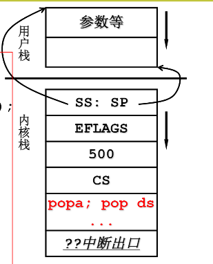

# 操作系统核心：多进程管理

我们在使用操作系统时，主要就是对多道程序进行使用，在我们开启多个程序后，操作系统要做的事就是对这些程序合理交叉运行在CUP上。

对于我们的多个要在计算机上处理的任务，操作系统要做的就是：`把这些进程记录好，要按照合理的次序推进(分配资源，进行调度)`形成一个多进程图像


## 多进程图像

多进程图像从启动开始到关机结束，例如Windows的桌面，和Linux的shell

在main.c中最后调用了：

````c
if(!fork()){init();}
````

这其实就会启动我们看到的shell窗口，也是一个程序，其核心思想是：

```c
int main(int agrc, char* argv[]){
    while(1){scanf("%s", cmd);
            if(!fork()){exec(cmd);}wait();}
}
```


我们假设用户先后启动了3个进程，我们感知这些进程的存在一般就通过其窗口之类的显性特点，而os是通过为每个进程建立一个进程控制                                                          块来记录进程的数据：`PCB Process Control Block`来感知并控制这些进程


## 多进程的组织：PCB+状态+队列

程序各自的状态：

+   就绪
+   运行
+   阻塞

当有多个程序运行时，他们就在这三种状态进行切换


该图称为进程状态图。

操作系统根据程序的这三中状态，分成三类，每一类由一个同状态的PCB队列组成。并把这三类列表放在不同的位置。


### 小结

如何形成多进程图像：

+    读写PCB，`os中最重要的结构，贯穿始终`
+   通过操作寄存器完成切换
+   要写调度程序
+   要有进程同步与合作
+   要有地址映射

## 用户级线程

进程 = 资源 + 指令执行序列

CPU在进程之间切换引出多进程，但是由于需要同时切换指令执行序列和资源映射表，从而造成了一些代价。

那么只切换指令执行序列，而不切换映射表就引出了线程。保留了并发的优点避免了进程切换的代价。


例一个浏览器：

+   一个线程用来从服务器下载数据
+   一个线程用来显示文本
+   一个线程用来处理图片
+   一个线程用来显示图片

如果该浏览器没有采用多线程，从头执行到尾，缺少与用户的交互性。


### 以多线程形式来实现一个浏览器

```c
void WebExplorer(){
    char URL[] = "https://....";
    char buffer[1000];
    pthread_create(...,GetData, URL,buffer);
    pthread_create(...,Show,buffer);
}
void GetData(char *URL, char *p){...};
void Show(char *p){....};
```

处理过程：


这样就可以把已经下载好的数据立马显示出来，提高交互性。所以问题的关键在与这两个线程的创建与切换。


### Create & Yield

想要实现启动两个线程，就要先知道他们要如何进行切换，`核心在于Yield，create就是要制造出第一次切换时应该的样子`

假设：

```c
//thread_1
100:A()
{
	B();
	104:
}
200:B()
{
	Yield();
	204:
}

//thread_2
300:C()
{
    D();
    304:
}
400:D()
{
    Yield();
    404:
}
```

#### 栈的使用问题

假如只使用一个栈


显然将导致栈中数据过于复杂，无法找到正确跳转地址。因此尝试用两个栈解决，一个线程一个栈。


两个栈：

引入TCB Thread Control Block用于存放线程的数据。


每个线程的栈分别用其TCB记录，这样每一次Yield通过切换esp就可以使对应的指令序列使用自己的栈

分析：

+   线程从A函数开始
+   进入B函数，调用Yield压入204地址，将当前esp保存并切换寄存器esp实现栈迁移`(通过Yield的}也就是ret)`
    +   `当然这里先要通过用户申请一段空间充当第二个栈，并生成TCB2记录其esp，把第二指令序列的起始地址放入该esp`

+   开始执行第二指令序列，最后也通过Yield一样的方法跳回去

两个线程的样子：


那么只要Yield该如何编写，Create就很清楚了：分别创建TCB，Stack，并初始化

````c
void ThreadCreate(A){
    TCB *tcb = malloc(..);
    STACK *stack = malloc(..);
    *stack = A;//100
    tcb.esp = stack //关联tcb与栈
}
````

那么浏览器大致框架：

```C
void WbeExplorer() //main()
{
    ThreadCreate(GetData, URL, buffer);...while(1) Yield();
}
void GetData(char *URL, char *p){
    连接URL; 下载; Yield();...
}
void ThreadCreate(func, arg1){
    申请栈;申请TCB;func等入栈;关联TCB与栈;...
}
void Yield(){
    压入现场;esp存入当前TCB;Next();从下一个TCB取出esp;ret 切换线程;
}//Next()调度函数，对系统影响很大，如可以优先调度show函数
```

### 小结

用户级线程通过TCB以及多个栈配合Yield实现指令序列之间来回切换也就是线程。

为什么说这是用户级线程：核心Yield函数是用户程序

可能会导致以下问题：

如果进程的某个线程进入内核并阻塞


比如浏览器从服务器下载数据时访问网卡(IO)发生阻塞

那么内核会认为进程1处于阻塞状态，从而切换到进程2

，而不会执行浏览器的show函数。


引入核心级线程：

其中ThreadCreate，是系统调用，会进入内核，内核知道TCB。那么上述问题如果再次出现，就可以让CPU切换到Show线程，`内核中通过Schedule来进行切换`。


## 核心级线程


当有了内核级线程，操作系统就可以把线程分配个多个CPU进行处理。


多核处理是比较常见的，多个CPU共用一个高速缓冲区和MMU，对于一个进程，就相当于资源不变，指令序列分别在这些CPU进行执行。

+   并发：同时启动
+   并行：同时处理

用户级，核心级不同点：

+   ThreadCreate是系统调用
+   内核管理TCB
+   内核负责切换线程
+   每个线程对应一套栈：用户栈-内核栈。
    +   TCB关联的是内核栈
    +   用户栈和内核栈由硬件进行关联


例：

````c
100:A(){
    B();
    104:
}
200:B(){
    read();
    204:
}
300:read(){
    int 0x80;
    304:
}

system_call:
	call sys_read;
	1000:

2000:sys_read(){...}
````

当该程序int 0x80后进入内核态，其内核栈与用户栈相关联，最后调用sys_read()时启动磁盘读，将自己变为阻塞状态，然后找到next(另一个线程或另一个进程的线程)，进行switch_to(cur, next)


关键点：？？？？代表什么

````c
//线程S
100:A(){
    ...
    int 0x80;
    ...
}
2000: sys_read(){..};
//线程T
500：C(){
    ...
interrupt:
    call sys_xxx;
  
}
3000:
4000: sys_xxx(){..}
````

线程s：

+   ？？？：是sys_read()函数中的某个地方
    +   从sys_read()某处启动磁盘读取后被阻塞，进行switch

线程T：

+   pc = ？？：线程T的指令序列中interrupt处某个地方
+   cs=？？：线程T用户态的cs
+   ？？？？：一段能完成二级返回的代码，一段包含iret 的代码


### 内核线程switch_to的五段论

+   中断入口：进入切换

    +   ```c
        push ds;...pusha;
        mov ds, 内核段号;...
        call 中断处理
        ```

+   中断处理：引发切换

    +   启动磁盘读或时钟中断；
    +   schedule(); } //ret

+   schedule：next = ...; call switch_to;} //ret

+   switch_to : 内核栈切换 (第一级切换)

    +   ````assembly
        TCB[cur].esp = %esp;
        %esp = TCB[next].esp;
        ret
        ````

+   中断出口：第二级切换

    +   ```assembly
        popa
        ....
        pop ds;
        iret
        ```

+   S，T非同一个进程：地址切换

    +   首先切换地址映射表；//内存管理
    +   TCB[cur].ldtr = %ldtr
    +   %ldtr = TCB[next].ldtr  

### ThreadCreate模型

了解内核线程如何切换后，系统调用ThreadCreate的模型如下：

```c
//目标指令序列--线程
500：C(){
    ....
}

//TthreadCreate系统调用
void ThreadCreate(){
    TCB tcb = get_free_page();
    /*两个栈的初始化*/
    *krlstack = ....;
    *userstack 传入;
    填写两个栈;
    tcb.esp = krlstack;
    tcb.状态 = 就绪;
    tcb入列;
}
```




### 五段论：中断入口和中断出口

+   通过sched_init将各种中断处理程序设置好。

+   int 0x80，发出中断信号并由硬件将此时一部分的寄存器放入内核栈

    +   ss，sp，EFLAGS，pc

+   system_call：继续将寄存器压入内核栈，并调用sys_xxx

    +   ds，es，fs，edx，ecx，ebx

    +   ```assembly
        	push %ds
        	push %es
        	push %fs
        	pushl %edx
        	pushl %ecx		# push %ebx,%ecx,%edx as parameters
        	pushl %ebx		#其中ebx.ecx,edx是作为sys_xxx的参数
        ```

    +   调用sys_xxx函数

+   调用sys_xxx时发现处于阻塞状态，则调用reschedule调度程序

    +   ```assembly
        reschedule:
        	pushl $ret_from_sys_call
        	jmp _schedule
        ```

    +   进入c程序schedule

    


### 五段论：schedule和中断出口

````c
void schedule(void){
    ....
    next = i;
    ....
    switch_to(next);
}
````

````assembly
ret_from_sys_call:
	....
	popl %eax !返回值
	popl %ebx
	popl %ecx
	popl %edx
	pop %fs
	pop %es
	pop %ds
	iret //返回到用户态
````


### 大致过程整理

在linux0.11下(不支持核心级线程)以read函数为例：

+   int 0x80：中断入口
    +   先由硬件控制：找到对应内核栈，压入SS,SP,EFLAGS,CS,CP
    +   后由软件控制：调用中断服务程序system_call，通知磁盘设备，如果磁盘设备此时数据未准备好则将程序的PCB状态置为阻塞，进入阻塞队列
+   判断得知程序为阻塞态，进行程序切换
    +   schedule从就绪队列中获取切换目标PCB
    +   schedule中的switch_to宏函数根据PCB->TSS结构体完成上下文切换
    +   完成该就绪程序的扫尾工作后，一顿pop+最后的iret返回对应的用户态继续执行
+   如果突然磁盘数据读写完成，外设发出中断信号，CPU接收停下当前任务，与外设进行数据交换，然后返回继续执行

关键：`PCB表，int 0x80硬件操作，schedule调度，CPU对于信号的响应`