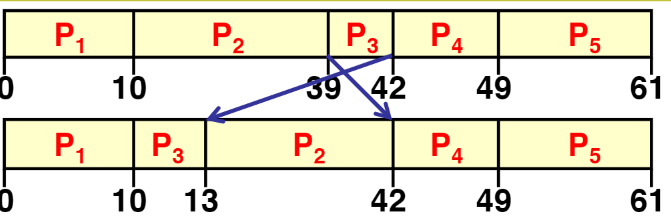
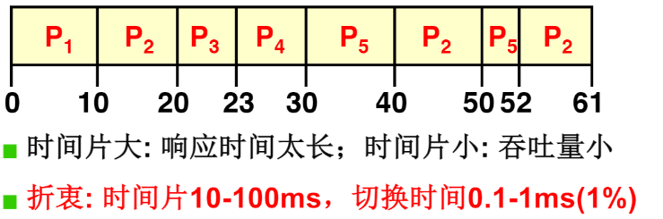

# 调度策略

在我们使用操作系统时整体上影响我们的使用感受的主要是程序的：`响应时间和周转时间`

+   周转时间：一个任务执行完毕所需要的时间
    +   一般对应后台任务，关注于完成任务

+   响应时间：从操作到发生响应所需要的时间
    +   一般对应前台任务，关注于及时响应


## 短作业先行 SJF

对于几乎是同一时间启动的一系列程序，不可能就只是让他门先到先执行，那么如果前面有一个时间很长的任务，就会影响的整体的程序执行时间



 所以要缩短整体的周转时间，显然需要让短作业优先完成


## RR：按时间片的轮转调度

比如使用一个word文档，虽然其周转时间很长但是更需要以响应时间先行，否则我们键入一个字符word可能需要等待10分钟才能显示出来。



在这情况下下每个程序最多一定长度的时间片


## schedule函数

对于一个操作系统，其实际的情况肯定是在任务队列中既有前台队列又有后台队列。

考虑到用户 的交互性体验，操作系统对前台任务的优先级要高，同时在前台任务中使用轮转的调度。后台任务使用短作业优先调度。但同时我们不能让前台任之间来回执行，而不考虑后台任务。所以要在两个队列中动态的调整执行的优先级，随着时间迁移后台队列优先级升高有机会进行执行，一旦后台任务进入执行可能需要占用比较长的CPU所以也应该在后台队列中插入一定时间片。

```c
void schedule(void)
{
....
....    

/* this is the scheduler proper: */
//counter 在这里对应时间片和优先级
	while (1) {
		c = -1;
		next = 0;
		i = NR_TASKS;
		p = &task[NR_TASKS];
		while (--i) {
			....
			if ((*p)->state == TASK_RUNNING && (*p)->counter > c)
				c = (*p)->counter, next = i;
		} //找到最大counter
		if (c) break;
		for(p = &LAST_TASK ; p > &FIRST_TASK ; --p)
			if (*p)
				(*p)->counter = ((*p)->counter >> 1) +
						(*p)->priority;
	}//增加时间片
	switch_to(next);  //最终要找到一个任务去执行
}
```

+   先从就绪队列中找到最大的counter，然后switch_to对应的程序
    +   首先通过优先级执行
+   当就绪队列时间片都为0，则对所有任务增加时间片
    +   这样之前处于阻塞对列的时间片将会比就绪队列的时间片大，优先级高
    +   等到阻塞程序进入就绪态时其优先级一般会比较高，由此照顾IO约束型程序，前台类型
+   同时由于(*p)->counter >> 1的存在所有程序的时间片不会很高，防止CPU约束型过长时间执行
+   由时钟中断的存在控制执行时间


这几句简单的算法就折中了大多数任务的需求。