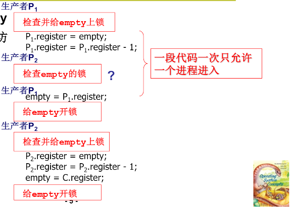
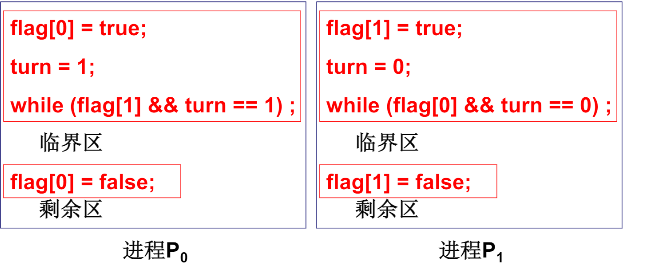

# 进程同步与信号量

信号量定义：一种特殊的整形变量，量用来记录，信号用来sleep或者wakeup进行

而不是一个单独 的信号，其包含的信息更为丰富。

信号量在进程同步中起着主要作用，想要进程协作，比起运作更重要的是什么时候停下。


```c
struct semaphore{
    int value; //信号量
    PCB *queue; //记录等待在该信号量上的进程
}

p(semaphore s){
    s.value--;
    if(s.value<0){
        sleep(s.queue);
    }
}
```

当两个进程共同修改信号量：

```assembly
!process1
register = empty;
register = register -1;
empty = register;

!process2
register = empty;
register = register -1;
empty = register;
```

empty为信号量，现在假设process1要进行empty = register时，时间片用完，切到process2那么这时process2得到的信号量就是一个虚假信息的，这就是所谓的`竞争条件`: 和调度有关的共享数据语义错误

信号量非常重要所以需要进行保护


## 信号量临界区保护

一个很直观的想法：就是一个程序在修改某个信号量时(通常是一段代码)，不得允许其他程序执行修改同一个信号量的代码，更不能在修改时切换到其他程序，也就是说要么那段进行修改信号量的代码一次做完，要么就干脆不做：也称为原子操作(不可拆分)



临界区：一次只允许一个进程进入的那一段代码：

````c
//剩余区
进入区
//临界区
退出区
//剩余区    
````

我们的核心就在于进入区与退出区的处理：

+   基本原则：互斥进入
+   优化规则：有空让进：尽快让进程进入空闲的临界区
    +   优先等待：从进程发出请求到允许进入不能无限等待


### Peterson算法



结合标记和轮转两种方法。
其正确性：

+   满足互斥进入：如果两个进程都进入则flag[0]=flag[1]=true, turn=0=1矛盾
+   满足有空让进：进程p1不在临界区则flag[1]=false, 或turn=0，p0都能进入
+   满足有限等待：p0要求进入，flag[0]=true 后面的p1不可能一直进入因为p1执行一次就会让turn=0


### 硬件原子指令法

意思是在硬件上开发一条指令可以直接测试并修改mutex的值

```c
//将一下指令在硬件上做成一句指令
boolean TestAndSet(boolean &x){
    boolean rv = x;
    x = true;
    return rv;
}
```

那么：

````c
while(TestAndSet &lock);
临界区
lock = false;
剩余区
````


### 小结

+   用信号量来维持进程的协作与同步
+   用临界区保护信号量


## 信号量的代码实现

首先内核中定义信号量数组，以及进行操作的系统调用

```c
//sem.c
typedef struct {
    char name[20];int value;
    task_struct* queue;
}semtable[20];

sys_sem_open(char *name){
    //在semtable中寻找对应name的项
    //没找到则创建
    //返回对应下标
}

sys_sem_wait(int sd){
    cli();
    if(semtable[sd].value-- < 0){
        //设置自己为阻塞
        //将自己加入semtable[sd].queue
        schelude();
        
    }
    sti();
}
//适用于单cpu的中断开关：cli()关闭中断响应 sti()启用中断响应
```

