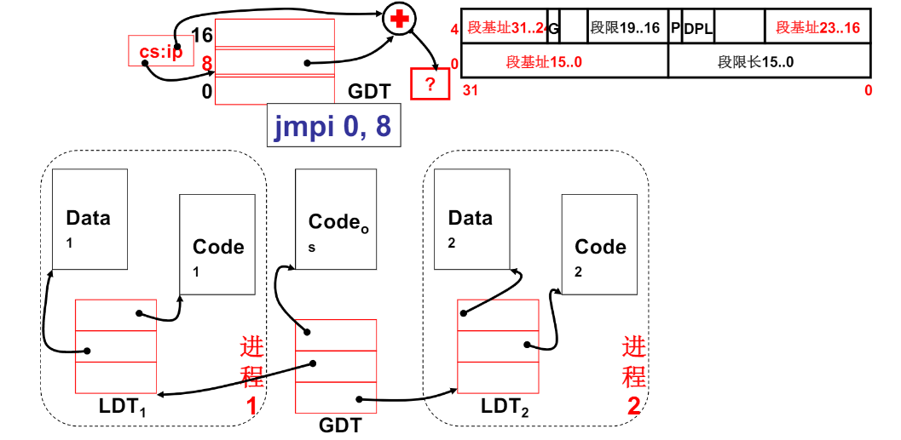
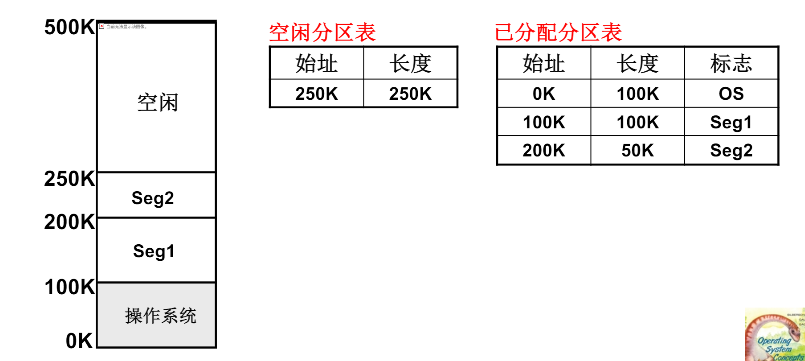
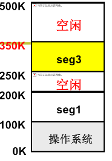
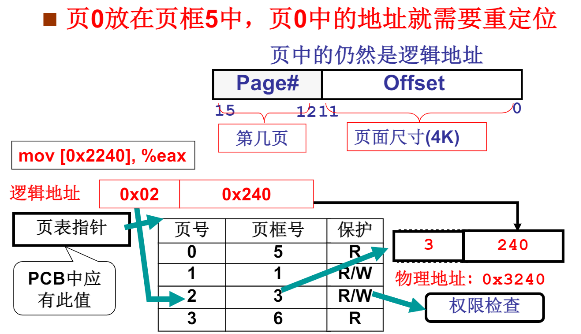

# 内存的使用与分段

前言：程序的载入执行是多变的，所以在内存中的位置也是比较自由的。因此大多数操作系统`对程序中的逻辑地址采取运行时重定位`: 实际的地址由`offset和基址`组成

其中基址放在程序的PCB结构体中

例如：

```assembly
!进程1
mov ax,[100]
```

该(每条)命令执行经过：

+   首先进程加载：os选择一块合适的空闲内存进行载入，并创建好其PCB表
+   执行到该指令：基址寄存器会先从PCB表中获得基址。然后根据程序中的逻辑地址计算的物理地址（地址翻译MMU）

+   如果进行切换进程，当然会根据PCB一起切换基址寄存器


## 引入分段

显然不可能在加载程序时，直接将整个程序放入内存，我们选择分段而治：即一个程序由多个段组成，这些段也有各自的基址


那么在将程序加载入内存时，就可以`根据内存和段的属性合理的分布他们的位置`，同时为了可以及时找到他们建立LDT(Local Description Table)段表来存放他们的段基址：


该表和GDT表类似，不过LDT由用户程序使用每个程序最多一个，而GDT由内核使用唯一一个。所以PCB表要包含这个结构体，同时GDT也要包含每个进程的LDT表




伏笔：分段与实际操作系统中的虚拟地址紧密相关


# 内存管理与分页

上面提到了利用段表将程序分段排布在内存中，那么就得先解决内存管理

我们同样可以引入一个核心数据结构来对内存进行分区以及记录，然后等到程序需要使用内存是根据该数据结构来引导程序的排布：



当建立好这个内存结构体时，就要考虑对于表中的可用内存该如何分配的问题：三个方案

+   首先适配
+   最佳适配
+   最差适配


## 引入分页

如果只是单纯的将对内存进行分区，那么势必会出现如下情况：



当请求大小为：0x160K时，虽然内存中的空闲空间是完全可以满足这个请求的，但是这些空间却是被其他程序隔开的，像这样的鸡肋空间就是`内存碎片`.


此时不妨提前将内存分成很小的一页：4K，同时对应一个叶匡。


结合程序的分段编译，当某一个段需要载入内存时，我们可以分配给相应的页数，并且可以将这些页打散分布在内存中，每个段都由属于自己的一系列叶片，然后根据页表结构体进行重定位：



对其逻辑地址的转换由硬件MMU来完成，也有CR3寄存器来存放对应页表的地址。