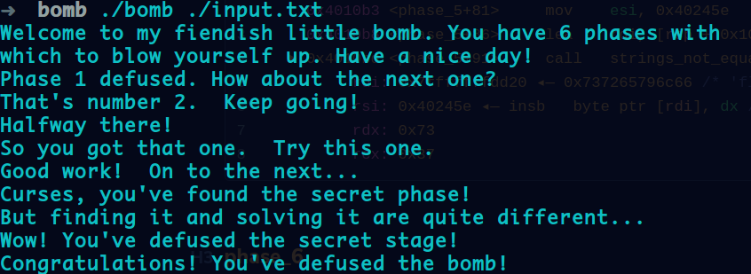

# Csapp lab1 lab2 和本周阅读笔记

## Data_Lab
详情见bits.c

## Bomb_Lab
### phase_1

````assembly
   0x400ee0 <phase_1>       sub    rsp, 8
   0x400ee4 <phase_1+4>     mov    esi, 0x402400
 ► 0x400ee9 <phase_1+9>     call   strings_not_equal <strings_not_equal>
        rdi: 0x603780 (input_strings) ◂— 'AAAAAAAA'
        rsi: 0x402400 ◂— outsd  dx, dword ptr [rsi] /* 'Border relations with Canada have never been better.' */
        rdx: 0x1
        rcx: 0x8
 
   0x400eee <phase_1+14>    test   eax, eax
   0x400ef0 <phase_1+16>    je     phase_1+23 <phase_1+23>
 
   0x400ef2 <phase_1+18>    call   explode_bomb <explode_bomb>

````

第一个phase还是挺简单的，只要输入Border relations with Canada have never been better.即可


### phase_2

也是一个挺简短的逻辑，可以根据汇编推c程序

````assembly
   0x0000000000400efc <+0>:	push   rbp
   0x0000000000400efd <+1>:	push   rbx
   0x0000000000400efe <+2>:	sub    rsp,0x28
   0x0000000000400f02 <+6>:	mov    rsi,rsp
   0x0000000000400f05 <+9>:	call   0x40145c <read_six_numbers>
   0x0000000000400f0a <+14>:	cmp    DWORD PTR [rsp],0x1
   0x0000000000400f0e <+18>:	je     0x400f30 <phase_2+52>
   0x0000000000400f10 <+20>:	call   0x40143a <explode_bomb>
   0x0000000000400f15 <+25>:	jmp    0x400f30 <phase_2+52>
   0x0000000000400f17 <+27>:	mov    eax,DWORD PTR [rbx-0x4]
   0x0000000000400f1a <+30>:	add    eax,eax
   0x0000000000400f1c <+32>:	cmp    DWORD PTR [rbx],eax
   0x0000000000400f1e <+34>:	je     0x400f25 <phase_2+41>
   0x0000000000400f20 <+36>:	call   0x40143a <explode_bomb>
   0x0000000000400f25 <+41>:	add    rbx,0x4
   0x0000000000400f29 <+45>:	cmp    rbx,rbp
=> 0x0000000000400f2c <+48>:	jne    0x400f17 <phase_2+27>
   0x0000000000400f2e <+50>:	jmp    0x400f3c <phase_2+64>
   0x0000000000400f30 <+52>:	lea    rbx,[rsp+0x4]
   0x0000000000400f35 <+57>:	lea    rbp,[rsp+0x18]
   0x0000000000400f3a <+62>:	jmp    0x400f17 <phase_2+27>
   0x0000000000400f3c <+64>:	add    rsp,0x28
   0x0000000000400f40 <+68>:	pop    rbx
   0x0000000000400f41 <+69>:	pop    rbp
   0x0000000000400f42 <+70>:	ret    

````

读入6个数字然后依次相互比较。

```c
void phase_2(){
 16     int nums[6];
 17     scanf("%d %d %d %d %d %d", nums, nums+1, nums+2, nums+3, nums+4, nums+5);
 18     if(nums[0]==1){
 19         for(int i=0;i<6;i++){
 20             if(nums[i]*2==nums[i+1])
 21                 continue;
 22             explode_bomb();
 23         }
 24 
 25     }
 26     explode_bomb();                                                              
 27 }
```


### phase_3

这里将要读入两个数据

```assembly
   0x0000000000400f71 <+46>:	mov    eax,DWORD PTR [rsp+0x8]
=> 0x0000000000400f75 <+50>:	jmp    QWORD PTR [rax*8+0x402470]
   0x0000000000400f7c <+57>:	mov    eax,0xcf
   0x0000000000400f81 <+62>:	jmp    0x400fbe <phase_3+123>
   0x0000000000400f83 <+64>:	mov    eax,0x2c3
   0x0000000000400f88 <+69>:	jmp    0x400fbe <phase_3+123>
   0x0000000000400f8a <+71>:	mov    eax,0x100
   0x0000000000400f8f <+76>:	jmp    0x400fbe <phase_3+123>
   0x0000000000400f91 <+78>:	mov    eax,0x185
   0x0000000000400f96 <+83>:	jmp    0x400fbe <phase_3+123>
   0x0000000000400f98 <+85>:	mov    eax,0xce
   0x0000000000400f9d <+90>:	jmp    0x400fbe <phase_3+123>
   0x0000000000400f9f <+92>:	mov    eax,0x2aa
   0x0000000000400fa4 <+97>:	jmp    0x400fbe <phase_3+123>
   0x0000000000400fa6 <+99>:	mov    eax,0x147
   0x0000000000400fab <+104>:	jmp    0x400fbe <phase_3+123>
   0x0000000000400fad <+106>:	call   0x40143a <explode_bomb>
   0x0000000000400fb2 <+111>:	mov    eax,0x0
   0x0000000000400fb7 <+116>:	jmp    0x400fbe <phase_3+123>
   0x0000000000400fb9 <+118>:	mov    eax,0x137
   0x0000000000400fbe <+123>:	cmp    eax,DWORD PTR [rsp+0xc]
   0x0000000000400fc2 <+127>:	je     0x400fc9 <phase_3+134>
   0x0000000000400fc4 <+129>:	call   0x40143a <explode_bomb>
   0x0000000000400fc9 <+134>:	add    rsp,0x18
   0x0000000000400fcd <+138>:	ret    

```

根据汇编，显然是根据第一个数跳转到7个赋值语句中，最后将赋值后的eax与我们输入的第二个数进行比较，如果不相等就引爆炸弹


### phase_4

首先

```assembly
   0x0000000000401024 <+24>:	call   0x400bf0 <__isoc99_sscanf@plt>
   0x0000000000401029 <+29>:	cmp    eax,0x2
   0x000000000040102c <+32>:	jne    0x401035 <phase_4+41>
=> 0x000000000040102e <+34>:	cmp    DWORD PTR [rsp+0x8],0xe
   0x0000000000401033 <+39>:	jbe    0x40103a <phase_4+46>
   0x0000000000401035 <+41>:	call   0x40143a <explode_bomb>
   0x000000000040103a <+46>:	mov    edx,0xe
   0x000000000040103f <+51>:	mov    esi,0x0
   0x0000000000401044 <+56>:	mov    edi,DWORD PTR [rsp+0x8]
   0x0000000000401048 <+60>:	call   0x400fce <func4>
   0x000000000040104d <+65>:	test   eax,eax
   0x000000000040104f <+67>:	jne    0x401058 <phase_4+76>
   0x0000000000401051 <+69>:	cmp    DWORD PTR [rsp+0xc],0x0
   0x0000000000401056 <+74>:	je     0x40105d <phase_4+81>
   0x0000000000401058 <+76>:	call   0x40143a <explode_bomb>
   0x000000000040105d <+81>:	add    rsp,0x18
   0x0000000000401061 <+85>:	ret    
```

根据汇编我们需要入读两个整数，否则引爆bomb。然后调用func4函数，根据下面的语句我们知道需要func4的返回值等于0，并且我们输入的第二个值等于0.

#### func4

```assembly
 ► 0x401048 <phase_4+60>    call   func4 <func4>
        rdi: 0x7
        rsi: 0x0
        rdx: 0xe
        rcx: 0x20

=> 0x0000000000400fce <+0>:	sub    rsp,0x8
   0x0000000000400fd2 <+4>:	mov    eax,edx
   0x0000000000400fd4 <+6>:	sub    eax,esi
   0x0000000000400fd6 <+8>:	mov    ecx,eax
   0x0000000000400fd8 <+10>:	shr    ecx,0x1f
   0x0000000000400fdb <+13>:	add    eax,ecx 
   0x0000000000400fdd <+15>:	sar    eax,1
   0x0000000000400fdf <+17>:	lea    ecx,[rax+rsi*1]
   0x0000000000400fe2 <+20>:	cmp    ecx,edi
   0x0000000000400fe4 <+22>:	jle    0x400ff2 <func4+36>
   0x0000000000400fe6 <+24>:	lea    edx,[rcx-0x1]
   0x0000000000400fe9 <+27>:	call   0x400fce <func4>
   0x0000000000400fee <+32>:	add    eax,eax
   0x0000000000400ff0 <+34>:	jmp    0x401007 <func4+57>
   0x0000000000400ff2 <+36>:	mov    eax,0x0
   0x0000000000400ff7 <+41>:	cmp    ecx,edi
   0x0000000000400ff9 <+43>:	jge    0x401007 <func4+57>
   0x0000000000400ffb <+45>:	lea    esi,[rcx+0x1]
   0x0000000000400ffe <+48>:	call   0x400fce <func4>
   0x0000000000401003 <+53>:	lea    eax,[rax+rax*1+0x1]
   0x0000000000401007 <+57>:	add    rsp,0x8
   0x000000000040100b <+61>:	ret    

```

可以看出这是一个递归调用，其主要运算发生在前面，可以大致写出c运算式

```c
int func4(int input0, int b, int c){
    ((c-b)>>31 + c-b)>>1 + b;
}
```

然后与input进行比较，第一次进入func4运算结果一定是7，根据接下来的语句我们只要输入7就可以一次通过func4并且返回值为0


### phase_5

这里我们需要输入6个字符

````assembly
   0x000000000040108b <+41>:	movzx  ecx,BYTE PTR [rbx+rax*1]
   0x000000000040108f <+45>:	mov    BYTE PTR [rsp],cl
=> 0x0000000000401092 <+48>:	mov    rdx,QWORD PTR [rsp]
   0x0000000000401096 <+52>:	and    edx,0xf
   0x0000000000401099 <+55>:	movzx  edx,BYTE PTR [rdx+0x4024b0]
   0x00000000004010a0 <+62>:	mov    BYTE PTR [rsp+rax*1+0x10],dl
   0x00000000004010a4 <+66>:	add    rax,0x1
   0x00000000004010a8 <+70>:	cmp    rax,0x6
   0x00000000004010ac <+74>:	jne    0x40108b <phase_5+41>
  
pwndbg> telescope 0x4024b0
00:0000│   0x4024b0 (array) ◂— insd   dword ptr [rdi], dx /* 'maduiersnfotvbylSo you think you can stop the bomb with ctrl-c, do you?' *
````

根据前面这一段汇编可知：依次将我们输入的6个字符与0xf进行与运算，然后根据与运算结果从给定字符串0x4024b0中取出对应下标的字符放入栈中

然后将其与另一个给定字符串比较：

````assembly
   0x4010ae <phase_5+76>     mov    byte ptr [rsp + 0x16], 0
   0x4010b3 <phase_5+81>     mov    esi, 0x40245e
   0x4010b8 <phase_5+86>     lea    rdi, [rsp + 0x10]
 ► 0x4010bd <phase_5+91>     call   strings_not_equal <strings_not_equal>
        rdi: 0x7fffffffdd20 ◂— 0x737265796c66 /* 'flyers' */
        rsi: 0x40245e ◂— insb   byte ptr [rdi], dx /* 'flyers' */
        rdx: 0x73
        rcx: 0x37
````


### phase_6

最后这一个汇编有点长，看了挺久的最后就给出整体逻辑吧

+   每个数字1~6 
+   前面的数字不能与后面的数字相同
+   7-每一个数，然后结果放入
+   按照结果顺序放入node
+   从上到下重新形成链表
+   从前到后对数据段进行比较，由大到小
+   input:4 3 2 1 6 5

node

````assembly
pwndbg> telescope 0x6032d0
00:0000│      0x6032d0 (node1) ◂— 0x10000014c
01:0008│      0x6032d8 (node1+8) —▸ 0x6032e0 (node2) ◂— 0x2000000a8
02:0010│      0x6032e0 (node2) ◂— 0x2000000a8
03:0018│      0x6032e8 (node2+8) —▸ 0x6032f0 (node3) ◂— 0x30000039c
04:0020│ rdx  0x6032f0 (node3) ◂— 0x30000039c
05:0028│      0x6032f8 (node3+8) —▸ 0x603300 (node4) ◂— 0x4000002b3
06:0030│      0x603300 (node4) ◂— 0x4000002b3
07:0038│      0x603308 (node4+8) —▸ 0x603310 (node5) ◂— 0x5000001dd
pwndbg> 
08:0040│   0x603310 (node5) ◂— 0x5000001dd
09:0048│   0x603318 (node5+8) —▸ 0x603320 (node6) ◂— 0x6000001bb
0a:0050│   0x603320 (node6) ◂— 0x6000001bb
0b:0058│   0x603328 (node6+8) ◂— 0x0

````


### secret phase

这个是看了K神的博客才知道有一个隐藏关卡

```assembly
   0x4015f5 <phase_defused+49>    mov    edi, input_strings+240 <0x603870>
 ► 0x4015fa <phase_defused+54>    call   __isoc99_sscanf@plt <__isoc99_sscanf@plt>
        s: 0x603870 (input_strings+240) ◂— '7 0 DrEvil'
        format: 0x402619 ◂— '%d %d %s'
        vararg: 0x7fffffffdcc8 ◂— 0x600000005
 
   0x4015ff <phase_defused+59>    cmp    eax, 3
   0x401602 <phase_defused+62>    jne    phase_defused+113 <phase_defused+113>
 
   0x401604 <phase_defused+64>    mov    esi, 0x402622
   0x401609 <phase_defused+69>    lea    rdi, [rsp + 0x10]
   0x40160e <phase_defused+74>    call   strings_not_equal <strings_not_equal>
```

这里会根据我门phase4的输入，如果最后是DrEvil字符串就会进入隐藏关卡


#### secret phase

````assembly
   0x0000000000401255 <+19>:	call   0x400bd0 <strtol@plt>
   0x000000000040125a <+24>:	mov    rbx,rax
   0x000000000040125d <+27>:	lea    eax,[rax-0x1]
   0x0000000000401260 <+30>:	cmp    eax,0x3e8
   0x0000000000401265 <+35>:	jbe    0x40126c <secret_phase+42>
   0x0000000000401267 <+37>:	call   0x40143a <explode_bomb>
   0x000000000040126c <+42>:	mov    esi,ebx
   0x000000000040126e <+44>:	mov    edi,0x6030f0
   0x0000000000401273 <+49>:	call   0x401204 <fun7>
   0x0000000000401278 <+54>:	cmp    eax,0x2
   0x000000000040127b <+57>:	je     0x401282 <secret_phase+64>
   0x000000000040127d <+59>:	call   0x40143a <explode_bomb>
   0x0000000000401282 <+64>:	mov    edi,0x402438
   0x0000000000401287 <+69>:	call   0x400b10 <puts@plt>
   0x000000000040128c <+74>:	call   0x4015c4 <phase_defused>
   0x0000000000401291 <+79>:	pop    rbx
   0x0000000000401292 <+80>:	ret    

````

首先我门需要输入一个不大于1001的数然后进入fun7函数，根据后面的判断可知fun7返回值要等于2

#### fun7

```assembly
   0x40126c <secret_phase+42>    mov    esi, ebx
   0x40126e <secret_phase+44>    mov    edi, n1 <0x6030f0>
 ► 0x401273 <secret_phase+49>    call   fun7 <fun7>
        rdi: 0x6030f0 (n1) ◂— 0x24 /* '$' */
        rsi: 0x16
        rdx: 0x0
        rcx: 0x603961 (input_strings+481) ◂— 0x32 /* '2' */
        
Dump of assembler code for function fun7:
=> 0x0000000000401204 <+0>:	sub    rsp,0x8
   0x0000000000401208 <+4>:	test   rdi,rdi
   0x000000000040120b <+7>:	je     0x401238 <fun7+52>
   0x000000000040120d <+9>:	mov    edx,DWORD PTR [rdi]
   0x000000000040120f <+11>:	cmp    edx,esi
   0x0000000000401211 <+13>:	jle    0x401220 <fun7+28>
   0x0000000000401213 <+15>:	mov    rdi,QWORD PTR [rdi+0x8]
   0x0000000000401217 <+19>:	call   0x401204 <fun7>
   0x000000000040121c <+24>:	add    eax,eax
   0x000000000040121e <+26>:	jmp    0x40123d <fun7+57>
   0x0000000000401220 <+28>:	mov    eax,0x0
   0x0000000000401225 <+33>:	cmp    edx,esi
   0x0000000000401227 <+35>:	je     0x40123d <fun7+57>
   0x0000000000401229 <+37>:	mov    rdi,QWORD PTR [rdi+0x10]
   0x000000000040122d <+41>:	call   0x401204 <fun7>
   0x0000000000401232 <+46>:	lea    eax,[rax+rax*1+0x1]
   0x0000000000401236 <+50>:	jmp    0x40123d <fun7+57>
   0x0000000000401238 <+52>:	mov    eax,0xffffffff
   0x000000000040123d <+57>:	add    rsp,0x8
   0x0000000000401241 <+61>:	ret    
```

fun7有两个参数，一个我们输入的值，另一个是一个结构体n。根据fun7的汇编知道这又是一个递归调用，还是写出c表达式比较好

```c
struct n;
struct n{
	long num;
	n *ptr1, *ptr2;
};
int fun7(n *ptr, long num){
	if(ptr == NULL) return -1;
	
	if(ptr->num <= num){
		if(ptr->num == num)
			return 0;
		return fun7(ptr->ptr2, num)*2 + 1;
	}else{
		return fun7(ptr->ptr1, num)*2;

	}

}
```

我们需要最终fun7返回值为2，所以调用顺序是：fun7 --> fun7\*2 --> fun7\*2 + 1 --> fun7=0

根据n结构体得出输入为22


做这个lab可比data lab顺利多了，那个太折磨人了感觉梦回高中数学。最后通关截图

