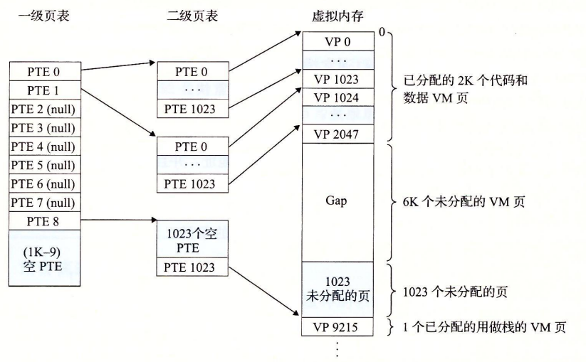
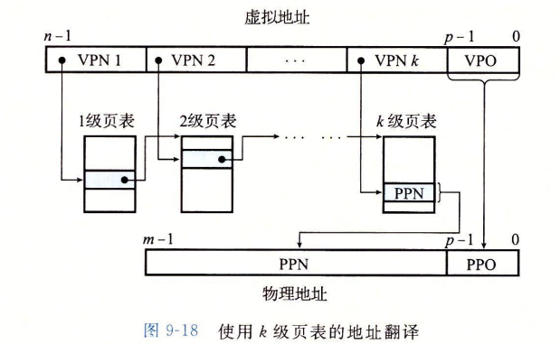
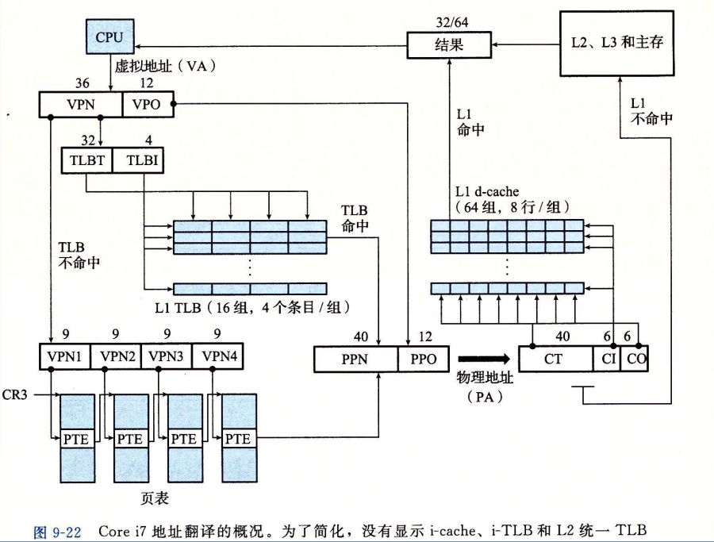
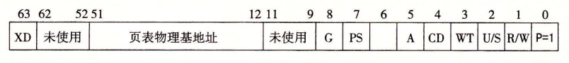
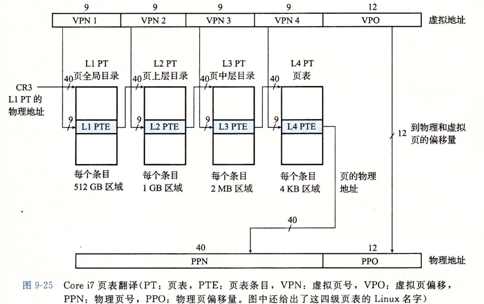
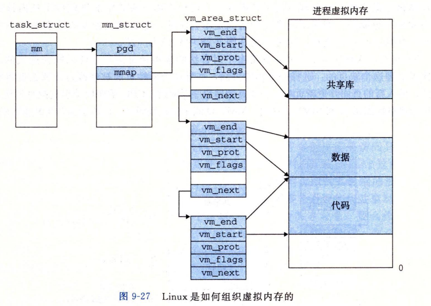
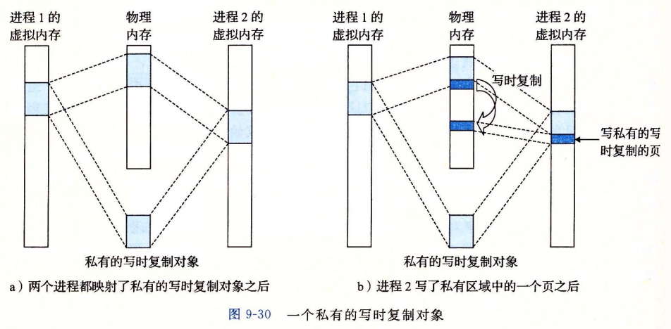
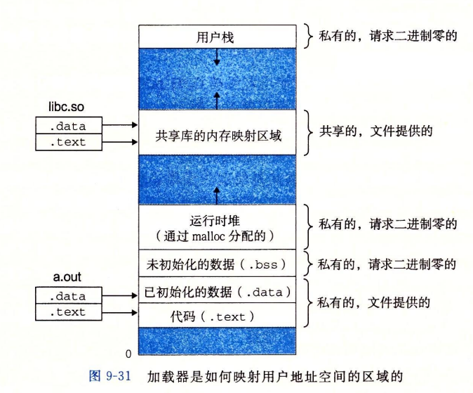

# 第二章 信息的表示与处理

## 程序的可移植性

基本C数据类型的典型大小

但是分配的字节数受程序是如何编译的影响而变化，为了避免依赖典型大小和不同编译带来的奇怪影响，ISO C99引入固定大小的数据类型：int32_t, int64_t 等相似数据类型，因此我们可以通过uint16_t来`无歧义的申明`一个16位无符号变量

## 补码

在许多场景中我们希望一个变量既可以表示正数也可以表示负数，所以最为常见的有符号数将会以补码的形式存放（而且许多数字默认是认为有符号数）。在这个定义中`将最高位解释为负权`，其他位按正常二进制权解释

### 转换

对于大多数C语言的实现，处理同样字长的有符号数和无符号数之间 相互转换的一般规则是：`改变位的解释方式，不改变位模式`，当然不同字长的数据进行转换时就会扩展或截断位模式

## IEEE浮点表示

使用该公式来表示一个浮点数

+   符号s：决定是正数还是负数
+   尾数M：是一个二进制小数
+   阶码E：对浮点数进行加权

将浮点数的位表示划分位三个字段，分别编码

根据阶码的值被编码的值可以分成一下不同情况：

# 第九章 虚拟内存

最开始CPU的寻址方式是物理寻址，这是CPU访问内存最自然的一种方式

而现代CPU采用虚拟寻址的形式

使用虚拟地址寻址离不开硬件和操作系统的配合，其中比较关键的是CPU利用一个虚拟地址(VA)来访问主存(当然CPU是不知道这是一个虚拟地址，它往死里用就完事了)，`VA经过MMU内存管理单元这个专用硬件通过放在主存中的查询表来动态翻译成物理地址(PA)`

## 虚拟内存作为缓冲工具

从概念上而言，虚拟内存被组织为一个存放在磁盘上的N个连续的字节大小的单元组成的数组。每个字节都由一个唯一的虚拟地址作为数组索引。

任意时刻虚拟页面都分为一下三种情况：

+   未分配的：VM系统还未分配(或创建)的页，未分配的块没有任何数据和他们相关联不占用任何磁盘空间
+   缓存的：当前以缓存在物理内存已分配的页
+   未缓存的：已分配但未缓存在物理内存中

### 页表

每次地址硬件讲一个虚拟地址翻译成物理地址时都会读取页表。操作系统负责维护页表内容，以及在磁盘与内存间来回传送页

虚拟地址空间的每个页在页表中的一个固定偏移量处都有一个页表项PTE(Page Table Entry),PTE包含一个有效位来说明该虚拟页是否缓存在DRAM中

### 缺页

当CPU引用也表中的一个虚拟页MMU发现该虚拟页没有缓存在物理内存中，这将引发一个缺页异常并调用内核中的缺页异常处理程序。缺页处理程序会从内存中选择一个牺牲页如果该页被修改了将其复制回磁盘。

接下来将CPU要引用的虚拟页缓存到物理内存中

## 虚拟内存作为内存管理工具

操作系统为每一个进程提供了一个独立的页表，也就是一个独立的虚拟地址空间。

优点：

+   简化链接：独立的地址空间允许每个进程的内存映像使用相同的基本格式，而不需要管代码和数据实际存放在物理内存中的何处
+   简化加载：要把目标文件的.text和.data节加载到一个新创建的进程中，Linux加载器为代码和数据段分配虚拟页，并标记为无效的(未缓存的)，将页表项指向目标文件中的适当位置即可。加载器不需要从磁盘到内存复制任何数据
+   简化共享
+   简化内存分配

## 虚拟内存作为内存保护的工具

每次CPU生成一个地址时，MMU会读到一个PTE，通过在PTE上添加一些额外的许可位来控制对一个虚拟页面内容的访问

## 地址翻译

+   处理器生成一个虚拟地址，并传送给MMU
+   MMU生成PTE地址，并从高速缓存/主存中请求得到它
+   高速缓存/主存向MMU返回PTE
+   MMU构造物理地址，并传送给高速缓存/主存
    +   若PTE有效位是0则触发缺页异常，控制转给异常处理程序
    +   缺页处理程序确定牺牲页，若牺牲页已被修改则把它换出到磁盘
    +   缺页处理程序调入新页面，并更新内存中的PTE
    +   返回到原来导致缺页的指令
+   高速缓存/主存返回所请求的数据给处理器

由于每次CPU产生一个虚拟地址都需要查找一个PTE，如果PTE没在高速缓存中而是内存将导耗时较长，为了消除这样的耗时甚至是在高速缓存中的时间花费，在MMU中包括一个关于PTE的小缓存：翻译后备缓冲器(Translation Lookaside Buffer  TLB).

TLB是一个小的，虚拟寻址的缓存其每一行都保存着一个由单个PTE组成的块。 

+   CPU产生一个虚拟地址
+   MMU从TLB取出对于PTE
+   MMU将这个虚拟地址翻译成物理地址。并发送到高速缓存/主存
+   请求的数据返回给CPU

当TLB不命中时，MMU从高速缓存/主存中取出相应PTE，新取出的PTE放入TLB，可能会覆盖一个已经存在的条目。

### 多级页表

为了像资本家一样剥削内存的使用效率，我们需要对页表进行压缩。比如在一个32虚拟地址空间和4K的单页一个页占4字节，那么即使程序只使用了空间中的一小部分也总需要一个4MB(4G/4K*4)的一级页表驻留在内存，那么如果面对更大的虚拟地址这个一级页表也会更大。

那么采用多级页表可以将常用的页表存放在更高效率的高速缓存中。

在上面的情况有许多一级页表并未分配，这样就没必要对其分配二级页表，这样减少了许多不必要的内存占用。

那么对于K级页表也是一样的道理，每一个VPNn都是对应级页表的offset，而一级页表基址在CR3中存放。

### 典例：Intel Core i7/Linux内系统

Core i7采用四季页表层次结构。每个进程在其task_struct中记录着一级页表基址，由CR3寄存器使用。

其中L1 d-cache和L1 TLB相似也是存放常用数据。

前三级一个页表项如下：

我们主要关注：

+   p：子页表是否在物理内存
+   R/W, U/S：读写权，root权限
+   XD：能否从这个PTE可以访问的所有页中读取指令
+   A：引用位
    +   内核使用A来实现其页面替换算法
    +   每次对页面进行写后MMU对其设置为D位，又称修改位，脏位()
    +   脏位告诉内核在进行替换时是否必须回写牺牲页
+   页表物理基址：那么这个必须4K对其

四级页表翻译过程：

套娃式的寻址，挺方便记忆的

### Linux虚拟内存系统

Linux将虚拟内存组织成一些区域(段)的集合。在task_struct进行记录：

我们主要关mm_struct中的pgd和mmap字段

+   pgd记录了一级页表的基址
+   mmap指向一个vm_area_struct链表
    +   每个vm_area_struct对应当前虚拟地址空间的一个段
    +   start：起始位置， end：终止位置
    +   prot：该段所有页的读写权
    +   flags：该段共享还是私有

那么有了这个结构 Linux在缺页异常处理时就会按以下流程：

+   检查虚拟地址是否在区域结构链表中，不在就触发段错误，终止
+   试图读写的内存是否合法，即权限检查
+   最后剩下的访问就是合法的了

## 内存映射

Linux将虚拟内存区域与一个磁盘上的对象关联起来，并初始化这个虚拟内存的内容，这一过程称为内存映射。

+   普通文件映射：将某个虚拟内存区域映射到一个普通磁盘文件，入一个可执行文件，但最终也是通过缺页机制将文件加载入物理内存
+   匿名映射：映射到一个匿名文件，该文件由内核创建，初始化为0的数据块。同样采用缺页机制

### 共享对象与私有对象

一开始共享对象和私有对象其实都只保留一份内存镜像在物理内存中，只是在某个程序开始对其进行写操作时产生显著差异：

+   共享对象映射到所有对他引用的虚拟内存中，某个进程对其虚拟内存中的共享对象映射进行修改，立即反映到物理内存上的修改，显然这一修改对所有引用该对象的进程可见
+   四有对象同样会映射到所有对他进行引用 的虚拟内存中，但一旦某个进程对其某页面进行写操作会触发一个保护故障，处理程序会先在物理内存中复制一个一样的页面然后程序将对该新页面进行写操作，这一机制称为：写时复制

写时复制触发是因为相应私有区域的页表条目都被标记为只读，并在区域结构中标记为私有属性，只要程序进行写操作就会触发故障程序。最后处理程序复制完页面后将新页面设置为可写的。很像缺页机制。

### fork函数与execve函数

通过上面的例子对于这两个函数就比较好理解了。

fork函数会通过内核为新进程创建各种数据结构，并为其分配一个唯一的PID，为了给其创建虚拟内存，它复制当前进程的mm_struct，区域链表和页表，然后将两个进程的每个页面都标记为只读，区域结构标记为私有，`最后通过其中一个进程的写来创建新的私有页面进行读写`。这样为每个进程保持了私有地址空间的抽象概念

execve函数加载目标可执行文件，然后可执行文件将有效代替当前程序，步骤如下：

+   删除已存在的用户区域：也就是删除存在的区域结构
+   映射私有区域：新程序的代码，数据，bss和堆栈都是私有的写时复制
+   映射共享区：如标准C库libc.so先动态链接到该程序，然后再映射到虚拟地址空间中的共享区域内
+   设置程序计数器(PC)：设置当前进程的上下文，使之指向代码区域入口

