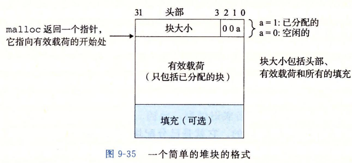
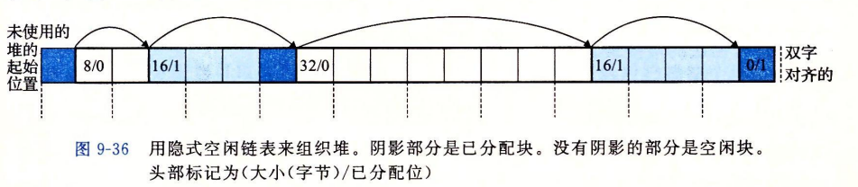
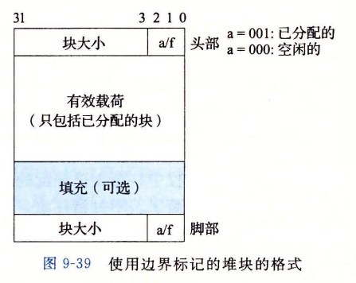
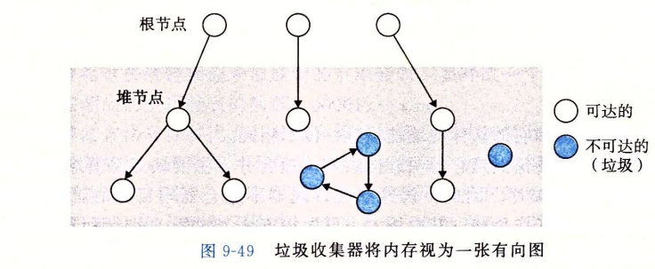
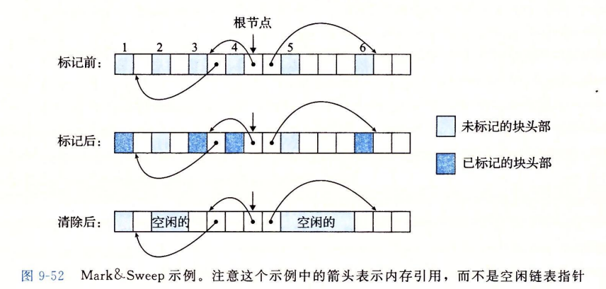

# 9 虚拟内存

继续完成上周的学习

## 9.9 动态内存分配

我们可以使用系统调用mmap和munmap来创建或删除虚拟内存区域，但是使用动态内存分配器更加方便，移植性也更好。

+   显示分配器：要求应用显式的释放任何已经分配的块。比如闻名于pwn菜单题的malloc.c
+   隐式分配器：要求分配器来检测一个已分配快何时不在被程序使用，然后将其释放。也叫做垃圾收集器，如JAVA中

了解过malloc源码，其主要依靠维护chunk结构体和显式空闲链表来实现堆块的动态分配，那这次就按照书上的先写一个隐式空闲链表的分配器。

### 分配器的要求和目标

要求

+   处理任意请求序列。分配器不可以假设分配和释放顺序
+   立即响应请求。
+   只使用堆，为了使分配器是可扩展的，分配器使用的任何非标量数据结构必须保存在堆中
+   对齐块
+   不修改已分配的块。分配器只能操作，改变空闲块

目标

+   最大化吞吐率。即执行请求的效率
+   最大化内存利用率。一个进程中的虚拟内存数量受磁盘上的交换空间的数量限制，要合理利用分配有限 的空间

碎片问题

+   内部碎片。即当需要的空间小于所获取的空间，多出来的那一部分
+   外部碎片。即当申请一定大小的堆块，空闲内存合计可以满足但是没有一个可以单独满足

由于外部碎片较为难处理，所以分配器通常试图来维持少量的大空闲块，而不是维持大量的小空闲块。

### 实现问题

+   空闲块组织：我们如何记录空闲块
+   放置：如何选择一个合适的空闲块来放置一个新分配的块
+   分割：将一个新块放置到某个空闲块之后，如何处理这个空闲块的剩余部分
+   合并：如何处理一个刚被释放的块

### 隐式空闲链表

其实核心就是一个可扩展的数组，数组成员也可扩展但是不想malloc.c中的chunk包含指针，既然是数组就就可以按照数据结构顺序表的方式来进行增，删，改，查 

基本元素：

查找方式（其中每一个块占4字节）：

### 放置已分配的块

分配器在搜索空闲块时，会面对许多种情况，当遍历到可满足的块时我们需要选定一个放置策略

常见策略有：

+   首次适配
+   下一次适配
+   最佳适配：这个比较实用一点

### 获取额外的堆内存

如果分配器始终无法找到能够满足要求的块，那么一般会有两个选择

+   合并物理项链的空闲块。在malloc.c中已经深有体会
+   如果合并后还是无法满足，那么就通过sbrk向内核请求额外的堆空间，在malloc.c中对于很大的块请求会使用mmap来满足

### 带边界标记的合并

通过在每个块中除了原有的头部，在结尾处添加一个脚部（footer）来提高查询效率

关键部分：

+   记录使用情况的字段
+   记录大小的字段

`主要是通过对这两个字段的引用来进行查找与放置堆块.当然在显示链表中还有指针字段`

### 显式空闲链表

malloc.c是一个非常好的例子。

单向空闲链表的分配器需要与空闲块数量呈线性关系的时间来分配块，现在一种流行的减少分配时间的方法，通常称为`分离存储`即维护多个空闲链表其中每个链表中的块有大致相等的大小.

两种基本的动态内存分配的分离存储方法：

+   简单分离存储：每个大小类的空闲链表包含大小相等的块，每当进行分配一个大小一定的块我们遍历相应空闲链表。满足则分配第一块的全部，并不会进行分割操作
+   分离适配：分配器维护着一个空闲链表数组，每个空闲链表和一个大小类关联，每个链表包含潜在的大小不同的块。每当分配一个大小一定的块先确定其大小类所在链表，并对其进行首次试配查找一个合适的块，如果找到就选择性分割返回给用户，剩余的重新插入相应的链表
    +   malloc.c完美诠释该方法
+   伙伴系统：是分离适配的一种特例，其中每个大小类都是2的幂。基本思路是，堆的大小为2\*\*m,字节为每一个块大小为2\*\*k维护一个分离空闲链表其中0<=<m.请求块向上舍入到2次幂，为了分配一个2\*\*k块，找到第一个满足的大小为2\*\*j的块其中k<=j<=m。如果j==k就直接返回，否则进行二分递归的切割这个块直到获得大小为2\*\*k的半块(伙伴)，然后返回，其他切出来的块插入对应空闲表
    +   缺点：导致显著的内部碎片

## 垃圾收集

将已分配的块视为内存中的节点，或叶。有一系列根节点指向内存中的块，这些根节点可以位于寄存器，栈或是全局变量中。

+   可达：能够直接或间接访问
+   不可达（垃圾）：无法访问

### Mark & Sweep垃圾收集器

个人理解是：其实根据可达和不可达就可以推测出垃圾收集是要干啥了，Mark即遍历所有根节点找到并标记所有可达块，然后执行Sweep对每个堆块进行检查，如果没被标记且已分配则释放

分配器设计重点：

+ 采取哪种数据结构进行空闲块管理
+ 单个块至少需要描述自身大小的size字段，状态字段state。然后根据不同的块管理方式嵌入所需要的字段进行寻址(如果需要进行合并的话)
+ 分配策略
+ 碎片处理