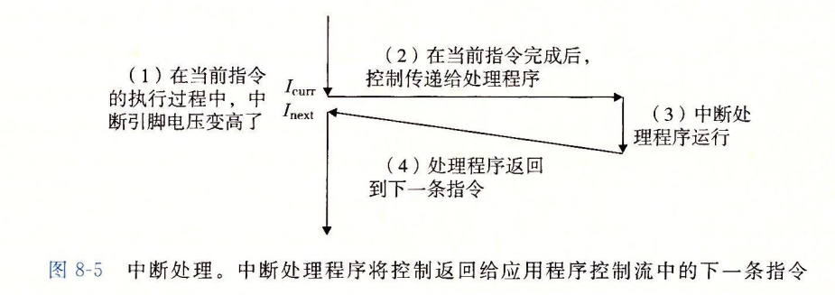

# 8异常控制流

异常控制流的实现一部分由硬件，一部分由操作系统实现。

异常就是控制流的突变，用来响应`处理器状态`中的某种变化.


## 8.1异常

在任何情况下，处理器检测到有事件发生时，就通过一个叫做`异常表`的跳转表，进行一个间接过程调用到一个专门设计用来处理这类事件的操作系统子程序：`异常处理程序(exception handler)`

当处理完异常后根据异常类型会发生以下三种情况之一：

+   异常处理程序将控制返回给 Icurr，即引发异常的那条指令
+   将控制返回给Inext，即下一条指令
+   不返回控制，终止程序

### 8.1.1异常处理

计算机启动时，操作系统会初始化异常表表，使其条目k中包含对应异常号k的异常处理程序的地址。


异常号是异常表中的索引，异常表的起始地址放在一个叫做`异常表基址寄存器`的特殊寄存器中

调用过程与系统调用陷入内核差不多


### 8.1.2 异常的类别

异常细分包括：中断(interrupt)，陷阱(trap)，故障(fault)，终止(abort)


+   中断：异步发生，是来自`处理器外部的IO设备信号`的结果。其通常不是由某一条专门的指令造成的，从这个意义来说是异步的。
    +   比如：磁盘控制器，定时器芯片等处理完毕后，通过向处理器芯片上的一个引脚发信号，并将异常号放在系统总线上。此时CPU处理完当前的指令后发现中断引脚的电压变高就从系统总线读取异常号，调用适当的中断处理程序
    +   
+   陷阱：是有意的异常，是执行一条指令的结果，其最重要的用途是在用户程序和内核之间提供一个接口即系统调用。
    +   如：执行syscall指令会导致一个异常处理程序的陷阱，并调用适当的内核程序

+   故障：由错误情况引起，他可能能够被故障处理程序修正。当故障发生时，处理程序将控制转移给故障处理程序，如果能修正该错误，就返回引起故障的指令重新执行否则abort 终止。
    +   如：缺页异常
+   终止：终止是不可恢复的致命错误造成的结果，通产是一些硬件错误
    +   如：除0，访问未定义的虚拟内存(segmentation fault)


## 8.4进程控制

从`程序员`的角度进程总处于一下三种模式之一：(内核角度不一样)

+   运行：进程要么现在在占用CPU，要么等待调度
+   停止：进程的执行被挂起(suspended)，且不会被调度。但是收到某些信号会影响其运行状态
+   终止：进程永远停止。如一个信号来终止进程，或从主程序返回，或调用exit函数

 

fork的微妙方面：

+   调用一次返回两次：这个与内核处理有关，有待学习

+   并发执行：注意和`并行`区分。作为程序员决不能对`不同进程的指令交替`执行做任何假设！
    +   内核fork后会创建一个新的PCB等待调度，不一定就会使用的PCB

+   相同但是独立的地址空间。可从第九章了解相关细节
+   共享文件：继承父进程所有打开文件。比如父子进程的stdout都是指向屏幕的，两者都将向屏幕输出

可以画图来理解执行流的可能性


### 8.4.3回收子进程

当一个进程由于某种原因终止时，`内核并不是立即把它从系统中清除`。而是将其保持在一种以终止的状态中，知道他被父进程回收(reaped)。这样父进程回收完毕后内核将子进程状态传递给父进程。然后抹除子进程的存在。

如果父进程提前终止，内核将安排init进程作为其`孤儿进程的养父`(太形象了)。init进程PID为1

以下是内核main函数启动init函数的部分，main函数PID为0

```c
	if (!fork()) {		/* we count on this going ok */
		init(); //子进程进入init
	}
```


一个进程可以通过调用waitpid函数来等待他的子进程终止或停止。

```c
pid_t waitpid(pid_t pid, int* statusp, int options);
```

该函数有点复杂，默认情况(optipns == 0)：waitpid挂起调用进程的执行(调用waitpid的进程)，直到其`等待集合(wait set)中的一个子进程终止/停止`。若等待集合中的一个进程在刚调用时刻就终止了，waitpid就立即返回。这两种情况中，waitpid返回`导致waitpid返回的`已终止子进程的PID。此时已终止的子进程就完成了回收

参数

+   pid：判定等待集合的成员
    +   pid>0：等待一个单独的子进程其进程ID就是PID
    +   pid=-1：等待集合就是父进程的所有子进程
+   options：修改默认行为，将其设置为常量：WNOHANG, WUNTRACED, WCONTINUED以及其各种组合来修改默认行为
+   statusp：已回收子进程的退出状态
    +   如果statusp参数非空，那么waitpid就会在status中放入`导致返回的`子进程的状态信息。
    +   其值由定义在wait.h的宏进行解释

wait函数：

````c
pid_t wait(int *statusp);
````

等价于：waitpid(-1, &status, 0)。配合while循环可以等待所有子进程


### 8.4.5加载并运行程序

execve函数在当前进程的上下文加载并运行一个程序。

```c
int execve(const char *filename, const char *argv[], const char *envp[]);
```

fork不同，execve函数不返回除非filename没找到，且不是复制进程而是替换进程也就是说没有创建新的PCB，新执行的程序其PID还是一样的。execve加载完filename后将控制传递给了新程序的main函数。

参数

+   filename：目标程序
+   argv：启动目标程序的参数列表，由NULL结尾
+   envp：filename运行的环境变量列表，由NULL结尾


main函数：

```c
int main(int argc, char *argv[], char *envp[]);
```

+   rdi：argc变成了参数列表的参数个数.
+   rsi：参数列表
+   rdx：环境变量列表

在gdb中把断点下载main上观察栈可以发现：

```assembly
25:0128│ rsi  0x7fffffffde98 —▸ 0x7fffffffe230 ◂— '/home/matrix/WorkSpace/Recoder/week3/waitpid1'
26:0130│      0x7fffffffdea0 —▸ 0x7fffffffe25e ◂— 0x632d00622d00612d /* '-a' */
27:0138│      0x7fffffffdea8 —▸ 0x7fffffffe261 ◂— 0x445800632d00622d /* '-b' */
pwndbg> 
28:0140│      0x7fffffffdeb0 —▸ 0x7fffffffe264 ◂— 0x535f47445800632d /* '-c' */
29:0148│      0x7fffffffdeb8 ◂— 0x0  <========NULL中断
2a:0150│ rdx  0x7fffffffdec0 —▸ 0x7fffffffe267 ◂— <====__environ 'XDG_SEAT_PATH=/org/freedesktop/DisplayManager/Seat0'
2b:0158│      0x7fffffffdec8 —▸ 0x7fffffffe29b ◂— 'XDG_CONFIG_DIRS=/etc/xdg/xdg-ubuntu:/usr/share/upstart/xdg:/etc/xdg'
2c:0160│      0x7fffffffded0 —▸ 0x7fffffffe2df ◂— 'SESSION=ubuntu'
2d:0168│      0x7fffffffded8 —▸ 0x7fffffffe2ee ◂— 'LANG=en_US.UTF-8'
2e:0170│      0x7fffffffdee0 —▸ 0x7fffffffe2ff ◂— 'DISPLAY=:0'
pwndbg> p /x __environ 
$1 = 0x7fffffffdec0

```

确实rsi存放参数列表并以NULL中断环境列表。全局变量environ存放环境变量指针

在cat ~/.profile发现rdx指向的列表中确实是环境变量。

