# 4 处理器体系结构

本章定义了一个类似x86-64的指令集：Y86-64，更加简单但是功能正确。

## Y86-64

Y86-64程序中每条指令都会读取或修改处理器状态的某些部分。这些部分称为程序员可见状态

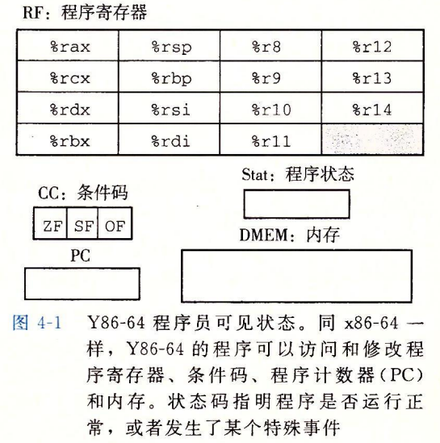

最后一个部分是状态码：stat，它表明程序执行的总体状态


### 4.1.2 Y86-64指令

Y86-84指令集基本上是x86-64的一个子集。但他只包括8字节整数操作(数据都为8字节)，寻址方式较少，操作也较少。汇编风格类似ATT

注意：

+   内存传送指令中内存引用方式为：基址+偏移
+   不允许将立即数送到内存，以及内存与内存间的传送
+   4个整数操作指令，但操作对象只能是寄存器
+   可以使用halt指令停止执行

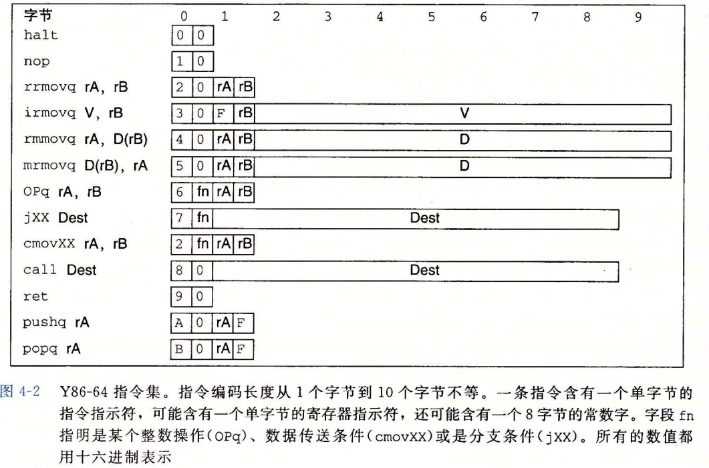

每条指令需要1~10个字节不等，主要取决于指令需要哪些字段。

+   第一个字节表明了指令类型：icode+ifunc 即低四位指定功能，高四位指定代码。功能值只有一组相关指令共用一个代码时才有用如jxx，ifunc指定具体跳转类型
+   分支指令和跳转指令的目的值是`一个绝对地址`


## 4.2逻辑设计和硬件控制语言HCL

HCL(HardWare Description Language)是一种文本表示，看上去和编程语言类似，但他是用来描述硬件结构而不是程序行为。本文使用的HCL语言只表达硬件设计的控制部分(组合逻辑块)，是一个有限的操作集合。

下图用HCL表示为：

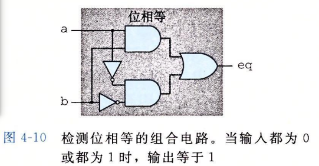

```c
bool eq = (a && b) || (!a && !b);
```

这个等号用来将eq与这个表达式联系起来，也就是给这个表达式起了个名字。

上面是进行的是位级的逻辑转换，将这样的位级逻辑门组成网就可以凿除更加复杂函数的组合电路。

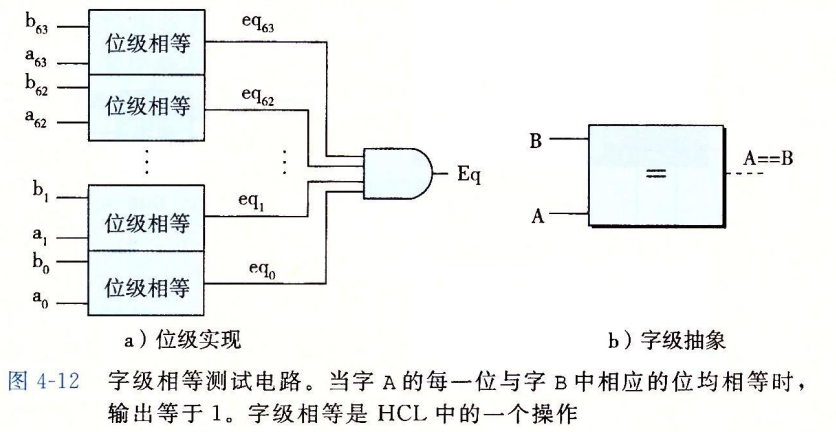

算数/逻辑单元ALU就是一个组合电路，包括A和B两个数据，和一个控制信号作为输入，根据不同的控制信号选择不同的操作

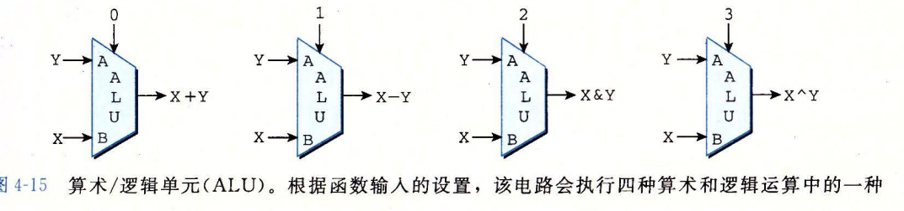

### 4.2.5存储器和时钟

存储设备都是由同一个时钟控制，时钟是一个周期性信号，决定什么时候把新值加载到设备中。

注意一下两种设备：

+   时钟寄存器：存储单个位或字，时钟信号控制寄存器加载输入值。如PC随着时钟信号不断读取下一个地址
+   随机访问存储器：存储多个字，用低脂来选择该读或者写哪个字。如虚拟内存系统，`寄存器文件`
    +   在此寄存器标识符(0~e)来表示对应寄存器地址


大多数情况寄存器的产生的输出等于它当前的状态，该状态眼寄存器前的组合逻辑传播(感觉在这里可以忽略)，当时钟信号变成高位时寄存器的输入端信号才会被加载进入，`也就是说每个上升沿寄存器值可以开始变化,其输出才会变化`

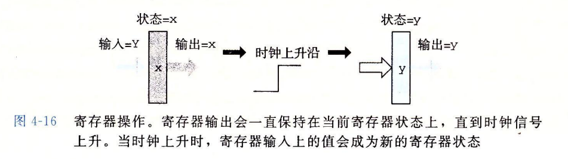

通过使用寄存器文件来指定寄存器进行读，写操作(当然写同样受控于时钟)。读端口通过先指定srcA与srcB然后valA和valB就会提供对应值，写端口操作类似

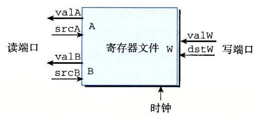


## 4.3 Y86-64的顺序实现

通常处理一条指令包括很多操作，将他们组织成一个特殊的阶段序列，即使指定的动作差异很大但所有指令都会遵循一个统一的序列，每一步的具体处理取决于正在执行的指令。这样就可以创建一个执行框架。下面是关于各个阶段以及其操作的简述：

+   取址：从PC所指向的内存读取指令字节：指令指示符/ 寄存器指示符/ 常数
+   译码：根据获得的寄存器指示符，从寄存器文件最多读入2个操作数
+   执行：ALU执行指令指示符表明的操作/  计算内存引用的有效地址 / 增加减少栈指针 得到的值为：valE
    +   ALU之所以称为算数逻辑计算单元，就是因为他`能干的就是计算`。`像取值，写值这样的操作人家不干`

+   访存：将数据写入内存，或将数据读出记为valM
+   回写：最多写两个结果到寄存器如popq reg
+   更新：将PC设置为下一条指令的地址

从此可以看出执行一条指令没有那么简单，需要的操作可能会很多。我们的挑战是`将每条不同的指令所需要的计算`放入通用框架中


### 4.3.2 SEQ硬件结构

实现所有Y86-64指令所需要的计算可以分为6个基本阶段。在SEQ中`所有的硬件单元的处理都在一个时钟周期内完成`

以下是一种顺序实现的硬件结构：

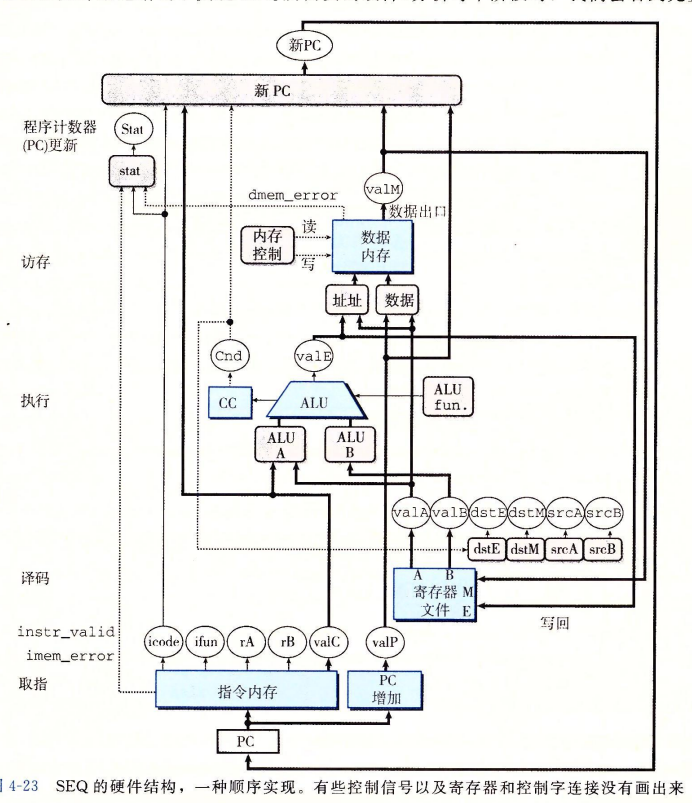

主要关注：控制逻辑块(圆角矩形表示)，不具备存储能力，主要用于选择信号传输与完成一些布尔函数用。可以看到这些逻辑控制块`掐住了众多硬件单元的喉咙：）`

逻辑控制块的目标：在不同硬件单元中传送数据，以及操作这些单元，`使得对于每个不同的指令执行指定的运算,以及使用指定的数据`

### 4.3.3 SEQ的时序

一个时钟变化会引发一个经过`组合逻辑的流`来执行整个指令。来看看如何实现一系列行为

要点：

+   组合逻辑不需要时序控制，只要输入变了值就会通过逻辑门网络传播，当然这信号人家收不收是人家的事
+   程序计数器，条件码寄存器，数据内存，寄存器文件由时钟信号统一触发(上升沿)写操作，即将新值载入
+   组合逻辑被条件码寄存器包围，因为有的组合逻辑(如ALU)即产生输入到条件码，又将条件吗码作为输入

#### 例子

初始状态是：执行完第三条指令，ZF，SF，OF设置为：100

 ```assembly
0x000:  irmovq $0x100, %rbx
0x00a:  irmovq $0x200, %rdx
0x014: 	addq 	%rdx, %rbx
0x016:	je dest
0x01f:	rmmvoq %rbx, (%rdx)
0x029: dest:
			halt
 ```

下面这张图应该有点小问题：`1，2阶段CC条件码寄存器都是100，以及rbx=0x200`

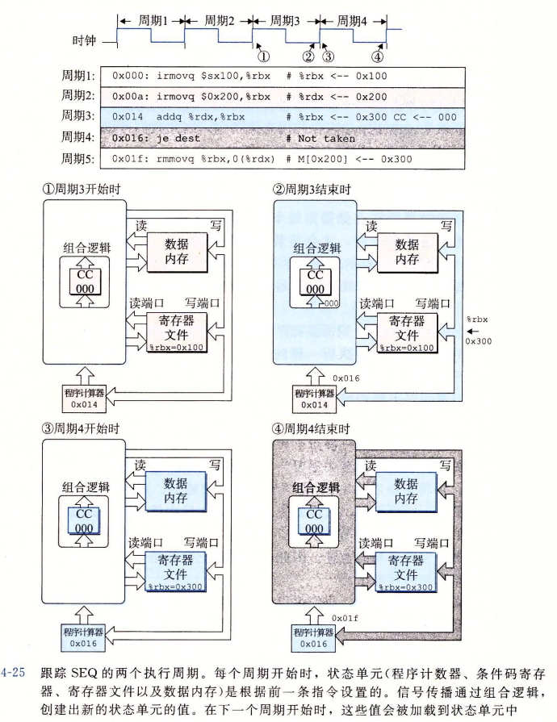

1.  从一个上升沿，周期二处理结果存储结构载入：CC=100(不变)，rbx载入0x200，PC载入下一条指令地址
2.  周期三期间完成指令的操作，取值计算，产生新的条件码000以及结果0x300，PC地址0x16
3.  周期三完成，遇到上升沿，所有的结果写入：PC=0x16，CC=000，rbx=0x300
4.  周期四，结果为PC将更新为0x1f
5.  周期四完成，遇到上升沿PC载入

可以概括为：

+   周期中：组合逻辑块+硬件完成指令操作部分
+   周期结束遇到上升沿：操作结果写入


## 4.5 Y86-64的流水线实现

通过主要动态调整PC值和流水寄存器来实现一个指令执行的流水线，在流水线上指令会被分成多段。这里是：`取址(F)，译码(D)，执行(E)，访存(M)，回写(W)`。以及每一阶段由一个时钟周期完成

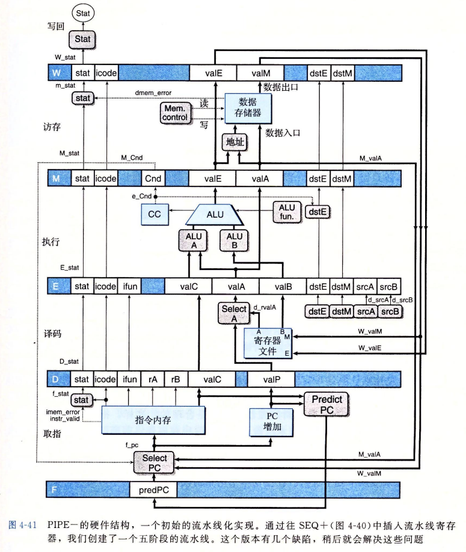

这样一条指令的第一阶段完成后，可以让第二条指令进入第一阶段，每次时钟周期的逻辑块结果同样在下一个时钟周期的上升沿载入寄存器(包括流水线寄存器)


### 4.5.5流水线冒险

源于：当相邻指令之间存在依赖关系时，会出现问题。其依赖包括：

+   数据相关：下条指令需要这里一条指令的计算结果
    +   如后一条指令需要前一条指令的计算结果
+   控制相关：一条指令要确定下一条
+   指令的位置
    +   如ret，条件跳转

如以下的数据冒险：

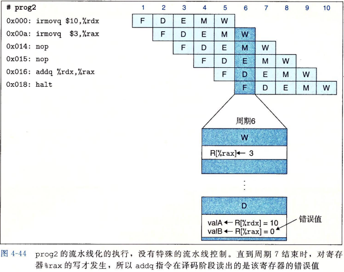

+   第一个irmovq执行结果刷入rdx的时间为：周期5结束，周期六开始
+   第二个irmovq执行结果刷入rax的时间为：周期六结束，周期七开始

那么问题就显而易见了：在执行addq指令的译码阶段时，只有rdx刷新了，rax还是0(默认值)

这就导致了数据冒险。个人感觉像CPU级的竞争冒险

我们主要需要关注的冒险：数据冒险， 控制冒险，正确处理异常 

### 数据冒险应对机制

+   暂停：当检测到当前指令所需的值，会被之前指令的执行或访存或回写阶段刷新时暂停

+   提前转发：对于前面指令的执行或访存或回写阶段将待刷新的值提前反馈到两个特殊块中
    +   主要针对译码阶段对valA和valB的提前获取

这里将两种方法结合可以解决所有的数据冒险这种方法称为加载互锁

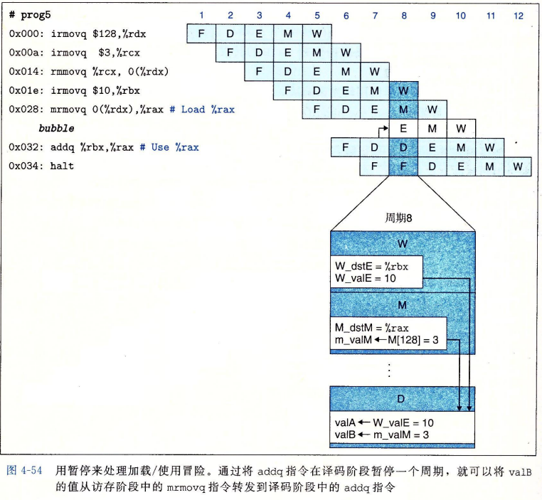

在这个的基础上，避免控制冒险可以通过插入气泡解决

