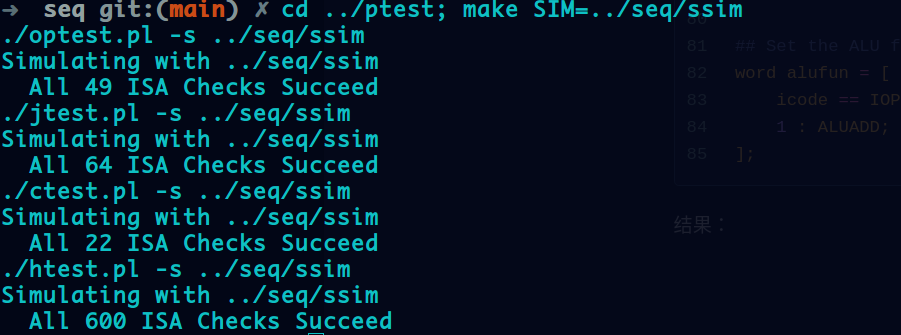

# Update Notice

## Update 2021/4/16

完成 Buffer_Lab，以及填坑上周说完成一个显示链表分配器(详见week2/my_malloc)。BufferLab不是很难，写了一个蹩脚的分配器感觉还是挺不错的，虽然不是很完备但是基本的分配功能还是有的。


## Update 2021/4/17

+   第八章异常控制流的部分阅读笔记
+   archlab

### 记录一下archlab: PartA

PartA要求用一个完备的Y86-86汇编实现给定的三个程序。一开始不是很习惯，看看书后发现这个语法和x86很类似更为简单，还是比较容易上手的。

第一个程序是一个对链表求和的程序，很简单用loop循环几次即可(详见sum.ys)

执行结果：

```assembly
Stopped in 26 steps at PC = 0x13.  Status 'HLT', CC Z=1 S=0 O=0
Changes to registers:
%rax:	0x0000000000000000	0x0000000000000cba
%rsp:	0x0000000000000000	0x0000000000000200
%r10:	0x0000000000000000	0x0000000000000c00

Changes to memory:
0x01f0:	0x0000000000000000	0x000000000000005b
0x01f8:	0x0000000000000000	0x0000000000000013
```


第二个要求用递归求和，这就需要用到栈了。顶多写写shellcode，不需要考虑栈的开辟，回收与储存。这次就算填个坑了，仿照一个普通函数的汇编格式，写出基本的函数开头与结尾：

````assembly
pushq %rbp
rrmovq %rsp, %rbp
irmovq $0x20, %r8
subq %r8, %rsp
....
...
rrmovq %rbp, %rsp
popq %rbp
ret
````

然后每一次递归把vla放在对应栈帧的特定偏移即可

执行结果

```assembly
Stopped in 73 steps at PC = 0x21.  Status 'HLT', CC Z=0 S=0 O=0
Changes to registers:
%rax:	0x0000000000000000	0x0000000000000cba
%rbx:	0x0000000000000000	0x000000000000000a
%rsp:	0x0000000000000000	0x00000000000002e0
%rbp:	0x0000000000000000	0x0000000000000300
%r8:	0x0000000000000000	0x0000000000000c00
%r10:	0x0000000000000000	0x0000000000000020

Changes to memory:
0x0210:	0x0000000000000000	0x0000000000000240
0x0218:	0x0000000000000000	0x00000000000000c2
0x0238:	0x0000000000000000	0x0000000000000c00
0x0240:	0x0000000000000000	0x0000000000000270
0x0248:	0x0000000000000000	0x00000000000000c2
0x0268:	0x0000000000000000	0x00000000000000b0
0x0270:	0x0000000000000000	0x00000000000002a0
0x0278:	0x0000000000000000	0x00000000000000c2
0x0298:	0x0000000000000000	0x000000000000000a
0x02a0:	0x0000000000000000	0x00000000000002d0
0x02a8:	0x0000000000000000	0x000000000000007b
0x02d0:	0x0000000000000000	0x0000000000000300
0x02d8:	0x0000000000000000	0x0000000000000021
```


第三个要求用指针的来copy数据以及求异或值，也比较简单(详见copy.ys)

执行结果

```assembly
Stopped in 41 steps at PC = 0x13.  Status 'HLT', CC Z=1 S=0 O=0
Changes to registers:
%rax:	0x0000000000000000	0x0000000000000cba
%rsp:	0x0000000000000000	0x0000000000000200
%rsi:	0x0000000000000000	0x0000000000000048
%rdi:	0x0000000000000000	0x0000000000000030
%r8:	0x0000000000000000	0x0000000000000008
%r9:	0x0000000000000000	0x0000000000000001
%r10:	0x0000000000000000	0x0000000000000c00

Changes to memory:
0x0030:	0x0000000000000111	0x000000000000000a
0x0038:	0x0000000000000222	0x00000000000000b0
0x0040:	0x0000000000000333	0x0000000000000c00
0x01f0:	0x0000000000000000	0x000000000000006f
0x01f8:	0x0000000000000000	0x0000000000000013
```


## Update 2021/4/21

PartB需要完成修改SEQ模拟器，来将iaddq加入指令集可以参照irmovq指令来处理

```bash
####################################################################
#    Control Signal Definitions.                                   #
####################################################################

################ Fetch Stage     ###################################

# Determine instruction code
word icode = [
	imem_error: INOP;
	1: imem_icode;		# Default: get from instruction memory
];

# Determine instruction function
word ifun = [
	imem_error: FNONE;
	1: imem_ifun;		# Default: get from instruction memory
];
#此处声明IIADDQ指令为合法指令
bool instr_valid = icode in 
	{ INOP, IHALT, IRRMOVQ, IIRMOVQ, IRMMOVQ, IMRMOVQ,
	       IOPQ, IJXX, ICALL, IRET, IPUSHQ, IPOPQ, IIADDQ};

# Does fetched instruction require a regid byte? 填入需要寄存器的指令
bool need_regids =
	icode in { IRRMOVQ, IOPQ, IPUSHQ, IPOPQ, 
		     IIRMOVQ, IRMMOVQ, IMRMOVQ , IIADDQ};

# Does fetched instruction require a constant word? 填入需要常数的指令
bool need_valC =
	icode in { IIRMOVQ, IRMMOVQ, IMRMOVQ, IJXX, ICALL, IIADDQ };

################ Decode Stage    ###################################

## What register should be used as the A source? 需要A口作为输入的指令
word srcA = [
	icode in { IRRMOVQ, IRMMOVQ, IOPQ, IPUSHQ  } : rA;
	icode in { IPOPQ, IRET } : RRSP;
	1 : RNONE; # Don't need register
];

## What register should be used as the B source? 需要B口作为输入的指令
word srcB = [
	icode in { IOPQ, IRMMOVQ, IMRMOVQ, IIADDQ } : rB;
	icode in { IPUSHQ, IPOPQ, ICALL, IRET } : RRSP;
	1 : RNONE;  # Don't need register
];

## What register should be used as the E destination? 指定计算结果存放
word dstE = [
	icode in { IRRMOVQ } && Cnd : rB;
	icode in { IIRMOVQ, IOPQ, IIADDQ} : rB;
	icode in { IPUSHQ, IPOPQ, ICALL, IRET } : RRSP;
	1 : RNONE;  # Don't write any register
];

## What register should be used as the M destination? 指定内存值存放 
word dstM = [
	icode in { IMRMOVQ, IPOPQ } : rA;
	1 : RNONE;  # Don't write any register
];

################ Execute Stage   ###################################

## Select input A to ALU  指定ALU的A口输入
word aluA = [
	icode in { IRRMOVQ, IOPQ } : valA;
	icode in { IIRMOVQ, IRMMOVQ, IMRMOVQ , IIADDQ} : valC;
	icode in { ICALL, IPUSHQ } : -8;
	icode in { IRET, IPOPQ } : 8;
	# Other instructions don't need ALU
];

## Select input B to ALU  #指定ALU的B口输入
word aluB = [
	icode in { IRMMOVQ, IMRMOVQ, IOPQ, ICALL, 
		      IPUSHQ, IRET, IPOPQ, IIADDQ } : valB;
	icode in { IRRMOVQ, IIRMOVQ } : 0;
	# Other instructions don't need ALU
];

## Set the ALU function #使用ALU的模式
word alufun = [
	icode == IOPQ : ifun;
	1 : ALUADD;
];
```

结果：




## Update 2021/4/22

完成第四章处理器结构体系的学习(Note)，以及对应ArchLab的实验Partc部分

Lab的PartC需要修改pipe-full.hcl和ncopy.ys来使得程序执行速度提高

### 修改的pipe部分

大致和PartB的SEQ差不多，主要添加IADDQ

````bash
# Is instruction valid?
bool instr_valid = f_icode in 
	{ INOP, IHALT, IRRMOVQ, IIRMOVQ, IRMMOVQ, IMRMOVQ,
	  IOPQ, IJXX, ICALL, IRET, IPUSHQ, IPOPQ, IIADDQ };
# Does fetched instruction require a regid byte?
bool need_regids =
	f_icode in { IRRMOVQ, IOPQ, IPUSHQ, IPOPQ, 
		     IIRMOVQ, IRMMOVQ, IMRMOVQ, IIADDQ };

# Does fetched instruction require a constant word?
bool need_valC =
	f_icode in { IIRMOVQ, IRMMOVQ, IMRMOVQ, IJXX, ICALL, IIADDQ };
## What register should be used as the B source?
word d_srcB = [
	D_icode in { IOPQ, IRMMOVQ, IMRMOVQ, IIADDQ } : D_rB;
	D_icode in { IPUSHQ, IPOPQ, ICALL, IRET } : RRSP;
	1 : RNONE;  # Don't need register
];

## What register should be used as the E destination?
word d_dstE = [
	D_icode in { IRRMOVQ, IIRMOVQ, IOPQ, IIADDQ} : D_rB;
	D_icode in { IPUSHQ, IPOPQ, ICALL, IRET } : RRSP;
	1 : RNONE;  # Don't write any register
];
## Select input A to ALU
word aluA = [
	E_icode in { IRRMOVQ, IOPQ } : E_valA;
	E_icode in { IIRMOVQ, IRMMOVQ, IMRMOVQ, IIADDQ} : E_valC;
	E_icode in { ICALL, IPUSHQ } : -8;
	E_icode in { IRET, IPOPQ } : 8;
	# Other instructions don't need ALU
];

## Select input B to ALU
word aluB = [
	E_icode in { IRMMOVQ, IMRMOVQ, IOPQ, ICALL, 
		     IPUSHQ, IRET, IPOPQinstr_valid, IIADDQ} : E_valB;
	E_icode in { IRRMOVQ, IIRMOVQ } : 0;
	# Other instructions don't need ALU
];
## Should the condition codes be updated?
bool set_cc = E_icode == IOPQ && E_icode == IIADDQ && 
	# State changes only during normal operation
	!m_stat in { SADR, SINS, SHLT } && !W_stat in { SADR, SINS, SHLT };
````

### 修改的

这里就把常数+寄存器的替换为IADDQ就差不多了

```assembly
# You can modify this portion
	# Loop header
	xorq %rax,%rax		# count = 0;
	andq %rdx,%rdx		# len <= 0?
	jle Done		# if so, goto Done:

Loop:	mrmovq (%rdi), %r10	# read val from src...
	rmmovq %r10, (%rsi)	# ...and store it to dst
	andq %r10, %r10		# val <= 0?
	jle Npos			# if so, goto Npos:
	iaddq $1, %rax		# count++ 
Npos:
	iaddq $-1, %rdx		# len-- 
	iaddq $8, %rdi		# src++ 
	iaddq $8, %rsi		# dst++ iaddq $8, %rsi
	andq %rdx,%rdx		# len > 0?
	jg Loop			# if so, goto Loop:
```

