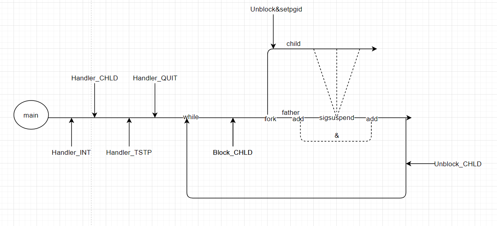

# shlab

需要实现的函数：
+ eval：解析并执行命令
+ builtin_cmd：识别并执行内置shell函数，包括quit,fg,bg,jobs
+ do_bgfd：实现fd，bg内置函数
+ waitfg：等待前台任务完成
+ sigchld_handler：捕捉并处理SIGCHLD信号 子进程停止或终止
+ sigint_handler：捕捉并处理SIGINT(ctrl-c)信号 来自键盘的中断
+ sigtstp_handler：捕捉并处理SIGTSTP(ctrl-z)信号

## 实现细节

主函数和子函数流水大致如下



### 进程组

在进行fork之后要对子进程setpgid(0, 0)使其在一个独立的进程组，这样shell收到的消息(ctrl-c/z)就可以通过消息处理函数用kill传送消息给子进程组，而不会影响其他进程组


### 子进程与父进程对jobs的竞争问题

这是在书上强调过的，应对措施是：在fork子进程前阻塞子进程变化信号。如果不阻塞child将可能在add之前结束触发对应消息处理函数：

```c
/*在回一个子进程后阻塞所有信号，来回收所有僵尸进程*/
void sigchld_handler(int sig) 
{
    int olderrno = errno;
    pid_t pid;
    sigset_t mask_all, prev_all;

    sigfillset(&mask_all);
    while((pid = waitpid(-1, NULL, WNOHANG)) > 0){
        sigprocmask(SIG_BLOCK, &mask_all, &prev_all);
        deletejob(jobs, pid);
        sigprocmask(SIG_SETMASK, &prev_all, NULL);
    }
    errno = olderrno;
}
```

那么在add之前就会进行一次删除，然后又add一个不存在的pid，这就导致竞争


### fork&&sigsuspend之后

在fork之后由于子进程继承了父进程的阻塞位向量，如果不解除之后shell传送给子进程组的信号(ctrl-c)将不会被响应。

然后就是在主函数的sigsuspend挂起收到信号结束后需要进行unblock也就是不阻塞任何信号，否则将会继续阻塞CHLD信号，那么下一轮循环：

```c
    if(!builtin_cmd(argv)){
        sigprocmask(SIG_BLOCK, &mask, &prev);  //<=======****
        if((pid = fork()) == 0){    //child run job
            setpgid(0, 0);
            sigprocmask(SIG_SETMASK, &prev, NULL);  //<=======***
            if(execve(argv[0], argv, environ) < 0){
                printf("%s Command not found.\n", argv[0]);
                exit(0);
            }
        }

        if(!in_bg){
            addjob(jobs, pid, FG, cmdline);                   
            sigsuspend(&prev);                      //等待fg_job     
            sigprocmask(SIG_SETMASK, &prev, NULL);  //作用问题问题所在  sigprocmask设定            
        }
        else{
            addjob(jobs, pid, BG, cmdline);
            struct job_t *tmp = getjobpid(jobs, pid);
            sigprocmask(SIG_SETMASK, &prev, NULL); //添加完成后撤销阻塞
            printf("[%d] %d %s", tmp->jid, tmp->pid, tmp->cmdline);
        }
    
    }
    return;
```

继续阻塞CHLD后子进程对信号阻塞(prev保存之前的状态)，之后子进程就无法控制


### 对waitpid的设置

在sigchld_handler中设置为：

```c
    sigfillset(&mask_all);
    while((pid = waitpid(-1, NULL, WNOHANG)) > 0){
        sigprocmask(SIG_BLOCK, &mask_all, &prev_all);
        deletejob(jobs, pid);
        sigprocmask(SIG_SETMASK, &prev_all, NULL);
    }
```

这样是为了回收所有的僵尸进程，以及防止在触发sigint_handler和sigtstp_handler后收到SIGINT和SIGTSTP之后进行删除操作

一开始设置的是WNOHANG|WUNTRACED，WUNTRACED作用：子进程终止或`停止`会返回其pid


### do_bgfg

bg：唤醒后台暂停的进程，主要是用kill发送一个SIGCONT即可

```c
    if(!strcmp(argv[0], "bg")){
        if(job_local->state != ST){
            printf("[%d] (%d) %s", job_local->jid, job_local->pid, job_local->cmdline);
            return;
        }
        else{
            kill(-job_local->pid, SIGCONT);
            job_local->state = BG;
            printf("[%d] (%d) %s", job_local->jid, job_local->pid, job_local->cmdline);
            return;
        }
    }
```

fg：用kill唤醒暂停的后台进程并`对其进行等待`。这应该就是前台进程和后台进程显式的不同

```c
    else{
        if(job_local->state == ST){
            kill(-job_local->pid, SIGCONT);
            job_local->state = FG;
        }
        waitfg(job_local->pid);
    }
```


