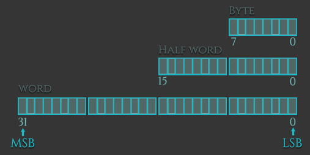

# Version
不同版本的arm架构会存在一些差异，所以这里统一版本为`32-bit ARMv6 (Raspberry Pi 1)`，其他的有：armv4，v5,v7-A， v7-R，v7-M

# Data Types

支持的数据类型：4字节(word)数据, 2字节(half word)数据，1字节(byte)数据


读写实例：

```bash
ldr = Load Word
ldrh = Load unsigned Half Word
ldrsh = Load signed Half Word
ldrb = Load unsigned Byte
ldrsb = Load signed Bytes

str = Store Word
strh = Store unsigned Half Word
strsh = Store signed Half Word
strb = Store unsigned Byte
strsb = Store signed Byte
```

# Register
看一下比较重要的寄存器：
+ r0-r3：分别对应函数的前4个参数
+ r0：存放执行/运算结果相当于eax
+ r11(Fp)：相当与ebp指向一个栈帧
+ r13(Sp)：相当于esp
+ r14(LR)：用于存放叶子函数的返回地址
+ r16(PC)：相当于eip
+ CPSR：程序状态寄存器相当于EFLAGS
+ r0-r6：普通寄存器相当于EAX，EBX，ECX，EDX，ESI，EDI

# Arm & Thumb
arm架构的处理器有主要的两种模式：`arm和thumb`
两者的主要的不同点在于指令集，arm模式指令永远都是4字节，而在thumb模式是2字节(也可能是4字节)

+ Thumb-1 (16-bit instructions): was used in `ARMv6` and earlier architectures.
+ Thumb-2 (16-bit and 32-bit instructions): extents Thumb-1 by adding more instructions and allowing them to be either 16-bit or 32-bit wide (ARMv6T2, ARMv7).
+ ThumbEE: includes some changes and additions aimed for dynamically generated code (code compiled on the device either shortly before or during execution).

# Instructions
指令结构为：
`MNEMONIC{S}{condition} {Rd}, Operand1, Operand2`
+ MNEMONIC：指令助记符
+ {S}：可选择后缀，可以影响CPSSR寄存器
+ {condition}：执行所需的条件
+ {Rd}：目标寄存器(Register destination)，存放指令执行结果
+ Operand1：第一个操作数，可以是寄存器或立即数
+ Operand2：第二个操作数，可以是立即数或寄存器或带位移操作的寄存器

第二个操作数例子：
```assembly
#123                    - Immediate value (with limited set of values). 
Rx                      - Register x (like R1, R2, R3 ...)
Rx, ASR n               - Register x with arithmetic shift right by n bits (1 = n = 32)
Rx, LSL n               - Register x with logical shift left by n bits (0 = n = 31)
Rx, LSR n               - Register x with logical shift right by n bits (1 = n = 32)
Rx, ROR n               - Register x with rotate right by n bits (1 = n = 31)
```
|Instruction | Description | Instruction | Description|
| MOV	| Move | data |	EOR	Bitwise XOR|
| ADD	| Addition	| STR	| Store|
| SUB	|Subtraction|	LDM	|Load Multiple|
| MUL	| Multiplication	|STM	|Store Multiple|
|LSL	|Logical Shift Left	|PUSH	Push on Stack|
|LSR	|Logical Shift Right	|POP	Pop off Stack|
|CMP	|Compare	|BX	Branch and eXchange|
| AND	Bitwise AND	|BLX	Branch with Link and eXchange|
|ORR	Bitwise OR	|SWI/SVC	System Call|

## Lord & Store
存取方式和x86感觉差不多

### Offset form: Immediate value as the offset
利用立即数作为偏移寻址：
```assembly
.data
var1: .word 3
var2: .word 4

.text
.global _start

_start:
    ldr r0, adr_var1  @ load the memory address of var1 via label adr_var1 into R0
    ldr r1, adr_var2  @ load the memory address of var2 via label adr_var2 into R1
    ldr r2, [r0]      @ load the value (0x03) at memory address found in R0 to register R2 
    str r2, [r1, #2]  @ address mode: offset. Store the value found in R2 (0x03) to the memory address found in R1 plus 2. Base register (R1) unmodified. 
    str r2, [r1, #4]! @ address mode: pre-indexed. Store the value found in R2 (0x03) to the memory address found in R1 plus 4. Base register (R1) modified: R1 = R1+4 
    ldr r3, [r1], #4  @ address mode: post-indexed. Load the value at memory address found in R1 to register R3. Base register (R1) modified: R1 = R1+4 
    bkpt
@这里存放的是地址
adr_var1: .word var1
adr_var2: .word var2
```
+ pre-indexed：提前变址，由`！`标识，在存取前修改基质址寄存器
+ post-indexed：延迟变址，在存取后修改

编译链接：`as ldr.s -o ldr.o; ld ldr.o -o ldr`
注意这里进行编译链接实arm环境下

和x86类似，ldr/str加载/存储数据，从某地址读取或写数据需要用寄存器和`[]`进行引用

### Offset form: Register as the offset.
用寄存器作为偏移寻址：
```assembly
.data
var1: .word 3
var2: .word 4

.text
.global _start

_start:
    ldr r0, adr_var1  @ load the memory address of var1 via label adr_var1 to R0 
    ldr r1, adr_var2  @ load the memory address of var2 via label adr_var2 to R1 
    ldr r2, [r0]      @ load the value (0x03) at memory address found in R0 to R2
    str r2, [r1, r2]  @ address mode: offset. Store the value found in R2 (0x03) to the memory address found in R1 with the offset R2 (0x03). Base register unmodified.   
    str r2, [r1, r2]! @ address mode: pre-indexed. Store value found in R2 (0x03) to the memory address found in R1 with the offset R2 (0x03). Base register modified: R1 = R1+R2. 
    ldr r3, [r1], r2  @ address mode: post-indexed. Load value at memory address found in R1 to register R3. Then modify base register: R1 = R1+R2.
    bx lr

adr_var1: .word var1
adr_var2: .word var2
```
没什么区别

### Offset form: Scaled register as the offset
经位移变化的寄存器作为偏移寻址：
```assembly
.data
var1: .word 3
var2: .word 4

.text
.global _start

_start:
    ldr r0, adr_var1         @ load the memory address of var1 via label adr_var1 to R0
    ldr r1, adr_var2         @ load the memory address of var2 via label adr_var2 to R1
    ldr r2, [r0]             @ load the value (0x03) at memory address found in R0 to R2
    str r2, [r1, r2, LSL#2]  @ address mode: offset. Store the value found in R2 (0x03) to the memory address found in R1 with the offset R2 left-shifted by 2. Base register (R1) unmodified.
    str r2, [r1, r2, LSL#2]! @ address mode: pre-indexed. Store the value found in R2 (0x03) to the memory address found in R1 with the offset R2 left-shifted by 2. Base register modified: R1 = R1 + R2<<2
    ldr r3, [r1], r2, LSL#2  @ address mode: post-indexed. Load value at memory address found in R1 to the register R3. Then modifiy base register: R1 = R1 + R2<<2
    bkpt

adr_var1: .word var1
adr_var2: .word var2
```

## LOAD/STORE MULTIPLE
多单元存取：
```assembly
.data

array_buff:
 .word 0x00000000             /* array_buff[0] */
 .word 0x00000000             /* array_buff[1] */
 .word 0x00000000             /* array_buff[2]. This element has a relative address of array_buff+8 */
 .word 0x00000000             /* array_buff[3] */
 .word 0x00000000             /* array_buff[4] */

.text
.global _start

_start:
 adr r0, words+12             /* address of words[3] -> r0 */
 ldr r1, array_buff_bridge    /* address of array_buff[0] -> r1 */
 ldr r2, array_buff_bridge+4  /* address of array_buff[2] -> r2 */
 ldm r0, {r4,r5}              /* words[3] -> r4 = 0x03; words[4] -> r5 = 0x04 */
 stm r1, {r4,r5}              /* r4 -> array_buff[0] = 0x03; r5 -> array_buff[1] = 0x04 */
 ldmia r0, {r4-r6}            /* words[3] -> r4 = 0x03, words[4] -> r5 = 0x04; words[5] -> r6 = 0x05; */
 stmia r1, {r4-r6}            /* r4 -> array_buff[0] = 0x03; r5 -> array_buff[1] = 0x04; r6 -> array_buff[2] = 0x05 */
 ldmib r0, {r4-r6}            /* words[4] -> r4 = 0x04; words[5] -> r5 = 0x05; words[6] -> r6 = 0x06 */
 stmib r1, {r4-r6}            /* r4 -> array_buff[1] = 0x04; r5 -> array_buff[2] = 0x05; r6 -> array_buff[3] = 0x06 */
 ldmda r0, {r4-r6}            /* words[3] -> r6 = 0x03; words[2] -> r5 = 0x02; words[1] -> r4 = 0x01 */
 ldmdb r0, {r4-r6}            /* words[2] -> r6 = 0x02; words[1] -> r5 = 0x01; words[0] -> r4 = 0x00 */
 stmda r2, {r4-r6}            /* r6 -> array_buff[2] = 0x02; r5 -> array_buff[1] = 0x01; r4 -> array_buff[0] = 0x00 */
 stmdb r2, {r4-r5}            /* r5 -> array_buff[1] = 0x01; r4 -> array_buff[0] = 0x00; */
 bx lr

words:
 .word 0x00000000             /* words[0] */
 .word 0x00000001             /* words[1] */
 .word 0x00000002             /* words[2] */
 .word 0x00000003             /* words[3] */
 .word 0x00000004             /* words[4] */
 .word 0x00000005             /* words[5] */
 .word 0x00000006             /* words[6] */

array_buff_bridge:
 .word array_buff             /* address of array_buff, or in other words - array_buff[0] */
 .word array_buff+8           /* address of array_buff[2] */
```
+ ldm/stm：表示一次加载/存储多个值
+ 后缀：
	+ -IA (increase after)：完成存取操作后地址增加 4字节
	+ -IB (increase before)：在存取操作之前增加4字节
	+ -DA (decrease after)：完成存取操作后减少4字节
	+ -DB (decrease before)：完成存取操作前减少4字节

## Push & Pop
```assembly
.text
.global _start

_start:
   mov r0, #3
   mov r1, #4
   push {r0, r1}
   pop {r2, r3}
   stmdb sp!, {r0, r1}
   ldmia sp!, {r4, r5}
   bkpt
```
+ stmdb sp!, {r0, r1}：将r0,r1先后存储到sp指向栈
	+ db结合sp!：存入前进行`sp -= 4`
	+ 相当于push {r0, r1}
+ ldmia sp!, {r4, r5}：将sp栈上的值分别加载到r4,r5
	+ ia结合sp！：加载一个值后`sp += 4`
	+ pop {r2, r3}
