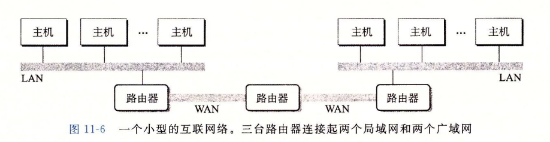

# 10 系统级IO

Linux文件类型：

+   普通文件：包含任意数据对内核而言没有二进制文件和文本文件之分
+   目录：包含一组链接的文件，每个链接都是将一个文件名(filename)映射到一个文件
+   套接字：用于跨网络通信的文件


内核用三个相关的数据结构来表示打开的文件：

+   描述符表：每个进程由其独立的描述符表，每个打开的描述符表项指向文件表中的一个表项
+   文件表：打开文件的集合由一张表来表示，所用进程共享该表。表项包括：
    +   当前文件位置
    +   引用计数
    +   v-node表项对应的指针
+   v-node表：所有进程共享，每个表项包含stat结构中的大多数信息(st_mode, st_size)


## IO重定向

通过上述结构来理解IO重定向的一种方法：使用dup2函数

```c
#include <unistd.h>
int dup2(int oldfd, int newfd);
```

复制描述符表项oldfd到newfd(覆盖)。如果复制之前newfd已经打开，那么会先关闭newfd

例：dup2(4, 1);原来fd_1已经打开，上图就会变为：


那么之后任何写到标准输出操作都会被重定向到文件B


## 使用RIO和标准库IO

本书提供了RIO包来完善unix IO函数(关于EOF，\n，中断等问题)同样标准库IO也提供类似更为强大的函数(fread, fwrite, fget)

RIO函数(其实类似于fread和read之分)：

+   带缓冲

    +   ```c
        ssize_t rio_readlineb(rio_t *rp, void *usrbuf, size_t maxlen);//读取文本行
        ssize_T rio_readnb(rio_t *rp, void *usrbuf, size_t n);//读取n个字节
        ```

+   不带缓冲

    +   ```c
        ssize_t rio_readn(int fd, void *usrbuf, size_t n);
        ssize_t rio_writen(int fd, void *usrbuf, size_t n);
        ```


使用的基本原则：

+   只要有可能就使用标准IO函数，`对于磁盘和终端设备IO来说是首选方法`
+   不要使用scanf和rio_readlineb来读取二进制文件
+   对于套接字IO使用RIO函数
    +   用sprintf格式化一个字符串后+rio_writen把他发送到套接口：socket_printf
    +   用rio_readlineb来读取一个完整的文本行+sscanf提取不同字段： socket_scanf


# 11 网络编程

cs模型：客户端(client)-服务器(server)编程模型.

一个cs事物由一下4步组成：


## LAN(Local Area Network, 局域网)

指一定区域内的计算机组，通过下图结构进行内部通信：


生活中的路由器和交换机就是保证内部通信的结构


WLAN(Wileless Local Area Network, 无线局域网)其实就是把线改为了电磁波


## WAN(Wide Area Network, 广域网)

最大的广域网：`Internet`

WAN是一种跨越大的、地域性的计算机网络的集合。通常跨越省、市，甚至一个国家。广域网包括大大小小不同的子网，子网可以是局域网，也可以是小型的广域网。(就像一个树结构)



由于不同地区的局域网/小型广域网可能采用完全不同的和不兼容的技术实现，所以如何让某一台主机跨过不兼容的网络发送信息？

解决方法是一层运行在每台主机和路由器上的软件协议，他消除了不同网络之间的差异。这个软件实现一种协议，这种协议`控制主机和路由器如何协同工作`来实现数据传输.必须提供两种基本能力：

+   命名机制：不同的局域网技术有不同的方式为主机分配地址，而依据互联网络协议每台主机会被分配到至少一个这种互联网络地址，这个地址唯一标识了这台主机
+   传送机制：在线缆上编码位和将这些位封装成帧方面，不同的互联网技术有不同的兼容方式。互联网络协议通过定义一种把数据位捆扎层不连续的片(包)的同一方式，消除这些差异

## Internet 连接

因特网客户端和服务器通过套接字对进行通信：(cliaddr:cliport, servaddr:servport)


套接字建立连接的过程：


主要为：

+   服务器先监听指定端口
+   服务器accept阻塞，等待连接请求
+   客户端对指定的ip:port进行连接
+   服务器accept成功建立连接


## Web服务器

web客户端和服务器之间的交互是`基于文本的应用级协议`叫做HTTP。web内容可以用HTML语言来编写并由HTML程序进行解释然后在屏幕上显示出来


### 请求内容(get)

根据请求的内容可以分为动态和静态内容，由URL对服务器上的资源进行定位，并且可以传输用于动态内容的参数

### 组成

HTTP请求包：

```bash
➜  ~ telnet www.aol.com 80
Trying 106.10.236.137...
Connected to www.aol.com.
Escape character is '^]'.
GET / HTTP/1.1			#request line  请求行由请求方法字段、URL字段和HTTP协议版本字段3个字段组成
Host: www.aol.com		#request header 请求报头
						#empty line terminates header 终止行
HTTP/1.0 400 Invalid HTTP Request	#response line
Date: Wed, 19 May 2021 11:18:45 GMT	#response header
Server: ATS							#response header
Cache-Control: no-store				#response header
Content-Type: text/html				#response header
Content-Language: en				#response header
Content-Length: 4313				#response header
									#empty line terminates header
<!DOCTYPE html>						#response body
<!-- saved from url=(0064)https://jira.ops.aol.com/secure/attachment/688199/failwhale.html -->
<html lang="en-us"><head><meta http-equiv="Content-Type" content="text/html; charset=UTF-8">
```

一个请求行+0个或多个请求报头+终止行。每行由"\r\n"表示结束，这里telnet自动加上

请求报头为服务器提供了额外的信息如：浏览器的商标名，我们关注Host报头这个报头在HTTP1.1的请求中是需要的在HTTP1.0不需要


HTTP响应包：

和请求包类似，组成为：一个响应行(response line)+0或多个响应报头(response header)+一个终止行+一个响应主体(response body)

